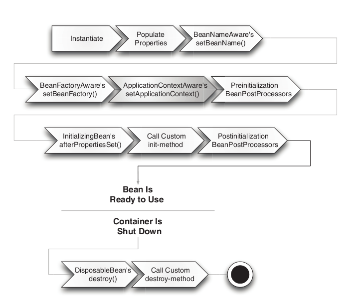

# Bean scopes and lifecycle

## Materials
+ Spring Bean Scopes
+ The Lifecycle of Spring Beans

## Spring Bean Scopes

You can control not only the various dependencies and configuration values that are to be plugged into an object that is
created from a particular bean definition but also control the scope of the objects created from a particular bean
definition. This approach is powerful and flexible, because you can choose the scope of the objects you create through
configuration instead of having to bake in the scope of an object at the Java class level. Beans can be defined to be
deployed in one of a number of scopes.

The Spring Framework supports six scopes, four of which are available only if you use a web-aware ApplicationContext:

* [singleton][1] - (Default) Scopes a single bean definition to a single object instance for each Spring IoC container.
* [prototype][2] - Scopes a single bean definition to any number of object instances.
* [request][3] - Scopes a single bean definition to the lifecycle of a single HTTP request. That is, each HTTP request
  has its own instance of a bean created off the back of a single bean definition. Only valid in the context of a
  web-aware Spring ApplicationContext.
* [session][4] - Scopes a single bean definition to the lifecycle of an HTTP Session. Only valid in the context of a
  web-aware Spring ApplicationContext.
* [application][5] - Scopes a single bean definition to the lifecycle of a ServletContext. Only valid in the context of
  a web-aware Spring ApplicationContext.
* [websocket][6] - Scopes a single bean definition to the lifecycle of a WebSocket. Only valid in the context of a
  web-aware Spring ApplicationContext.

You can also create a custom scope.

### Singleton Scope

When we define a bean with the singleton scope, the container creates a single instance of that bean; all requests for
that bean name will return the same object, which is cached. Any modifications to the object will be reflected in all
references to the bean. This scope is the default value if no other scope is specified.

Let's define the bean with the singleton scope by using the `@Scope` annotation:

```java

@Component
@Scope("singleton") // or @Scope(ConfigurableBeanFactory.SCOPE_SINGLETON)
public class SingletonBean {
    // implementation goes here...
}
```

### Prototype Scope

A bean with the prototype scope will return a different instance every time it is requested from the container. It is
defined by setting the value prototype to the `@Scope` annotation in the bean definition:

```java

@Component
@Scope("prototype") // or @Scope(ConfigurableBeanFactory.SCOPE_PROTOTYPE)
public class PrototypeBean {
    // implementation goes here...
}
```

### Web Aware Scopes

As previously mentioned, there are four additional scopes that are only available in a web-aware application context. We
use these less often in practice.

The request scope creates a bean instance for a single HTTP request, while the session scope creates a bean instance for
an HTTP Session.

The application scope creates the bean instance for the lifecycle of a ServletContext, and the websocket scope creates
it for a particular WebSocket session.

Let's create a class to use for instantiating the beans:

```java
public interface MessageHolder {

    String getMessage();

    void setMessage(String message);
}

public class SimpleMessageHolder implements MessageHolder {

    private String message;

    @Override
    public String getMessage() {
        return message;
    }

    @Override
    void setMessage(String message) {
        this.message = message;
    }
}
```

#### Request Scope

We can define the bean with the request scope using the `@Scope` annotation:

```java

@Configuration
public class Config {

    @Bean
    @Scope(value = WebApplicationContext.SCOPE_REQUEST, proxyMode = ScopedProxyMode.INTERFACES)
    public MessageHolder requestScopedMessageHolder() {
        return new SimpleMessageHolder();
    }
}
```

The `proxyMode` attribute is necessary because at the moment of the instantiation of the web application context, there
is no active request. Spring creates a proxy to be injected as a dependency, and instantiates the target bean when it is
needed in a request.

It is worth to mention that in case when the bean has no interfaces, `ScopedProxyMode.TARGET_CLASS` should be used - in
this case Spring framework will create using so-called cglib-proxy instance.

We can also use a `@RequestScope` composed annotation that acts as a shortcut for the above definition.

Next we can define a controller that has an injected reference to the requestScopedMessageHolder. We need to access the
same request twice in order to test the web specific scopes.

If we display the message each time the request is run, we can see that the value initially set to null, even though it
is later changed in the method. This is because of a different bean instance being returned for each request.

```java

@RestController
public class MyController {

    @Autowired
    @Qualifier("requestScopedMessageHolder")
    private MessageHolder requestScopedMessageHolder;

    @RequestMapping("/scopes/request")
    public void checkRequestScopedBean(@RequestParam String message) {
        System.out.printf("prevMessage: %s%n", requestScopedMessageHolder.getMessage());
        requestScopedBean.setMessage(message);
        System.out.printf("currMessage: %s%n", requestScopedMessageHolder.getMessage());
    }
}
```

#### Session Scope

We can define the bean with the session scope in a similar manner:

```java

@Configuration
public class Config {
    @Bean
    @Scope(value = WebApplicationContext.SCOPE_SESSION, proxyMode = ScopedProxyMode.INTERFACES)
    public MessageHolder sessionScopedMessageHolder() {
        return new SimpleMessageHolder();
    }
}
```

There's also a dedicated composed annotation `@SessionScope` we can use to simplify the bean definition.

Next we define a controller with a reference to the sessionScopedMessageHolder. Again, we need to run two requests in
order to show that the value of the message field is the same for the session.

In this case, when the request is made for the first time, the value message is `null`. However, once it is changed,
that value is retained for subsequent requests as the same instance of the bean is returned for the entire session.

```java

@RestController
public class MyController {

    @Autowired
    @Qualifier("sessionScopedMessageHolder")
    private MessageHolder sessionScopedMessageHolder;

    @RequestMapping("/scopes/session")
    public void checkRequestScopedBean(@RequestParam String message) {
        System.out.printf("prevMessage: %s%n", sessionScopedMessageHolder.getMessage());
        requestScopedBean.setMessage(message);
        System.out.printf("currMessage: %s%n", sessionScopedMessageHolder.getMessage());
    }
}
```

#### Application Scope

The application scope creates the bean instance for the lifecycle of a ServletContext.

This is similar to the singleton scope, but there is a very important difference in regard to the scope of the bean.

When beans are application scoped, the same instance of the bean is shared across multiple servlet-based applications
running in the same ServletContext, while singleton scoped beans are scoped to a single application context only.

Let's create the bean with the application scope:

```java

@Configuration
public class Config {
    @Bean
    @Scope(value = WebApplicationContext.SCOPE_APPLICATION, proxyMode = ScopedProxyMode.INTERFACES)
    public MessageHolder applicationScopedMessageHolder() {
        return new SimpleMessageHolder();
    }
}
```

Analogous to the request and session scopes, we can use a shorter version - `@ApplicationScope`.

Now let's create a controller that references this bean:

```java

@RestController
public class MyController {

    @Autowired
    @Qualifier("applicationScopedMessageHolder")
    private MessageHolder applicationScopedMessageHolder;

    @RequestMapping("/scopes/application")
    public void checkRequestScopedBean(@RequestParam String message) {
        System.out.printf("prevMessage: %s%n", applicationScopedMessageHolder.getMessage());
        requestScopedBean.setMessage(message);
        System.out.printf("currMessage: %s%n", applicationScopedMessageHolder.getMessage());
    }
}
```

In this case, once set in the applicationScopedMessageHolder, the value message will be retained for all subsequent
requests, sessions and even for different servlet applications that will access this bean, provided it is running in the
same ServletContext.

#### WebSocket Scope

Finally, let's create the bean with the websocket scope:

```java

@Configuration
public class Config {
    @Bean
    @Scope(value = "websocket", proxyMode = ScopedProxyMode.INTERFACES)
    public MessageHolder websocketScopedMessageHolder() {
        return new SimpleMessageHolder();
    }
}
```

When first accessed, WebSocket scoped beans are stored in the WebSocket session attributes. The same instance of the
bean is then returned whenever that bean is accessed during the entire WebSocket session.

We can also say that it exhibits singleton behavior, but limited to a WebSocket session only.

> **_Note:_**
>
> It's worth to mention that there is the alternative to specify `proxyMode` each time declaring Spring-bean - instead
> of it, you can declare your bean-dependency as a `Provider<T>` instance, where `T` - is a type of your dependency.
>
> In our case we could refactor `MyController` class to look like this:
>
> ```java
> @RestController
> public class MyController {
>
>    @Autowired
>    @Qualifier("applicationScopedMessageHolder")
>    private Provider<MessageHolder> applicationScopedMessageHolder;
>
>    @RequestMapping("/scopes/application")
>    public void checkRequestScopedBean(@RequestParam String message) {
>        MessageHolder messageHolder = applicationScopedMessageHolder.get();
>        System.out.printf("prevMessage: %s%n", messageHolder.getMessage());
>        requestScopedBean.setMessage(message);
>        System.out.printf("currMessage: %s%n", messageHolder.getMessage());
>    }
> }
> ```
>
> Each time calling `Provider#get` method returns bean instance according to the declared bean scope.

## The Lifecycle of Spring Beans

The Spring IoC container is responsible for instantiating, initializing, and wiring beans, which are just Spring-managed
instances of a Java classes. The container also manages the life cycle of beans.

The figure below shows two parts of the Spring bean lifecycle:



* Part 1: shows the different stages a bean goes through after instantiation until it is ready for use.
* Part 2: shows what happens to a bean once the Spring IoC container shuts down.

### How to Customize the Bean Life Cycle

Spring framework provides the following four ways for controlling life cycle events of a bean:

* `InitializingBean` and `DisposableBean` callback interfaces
* Aware interfaces for specific behavior
* Custom `init` and `destroy` methods in bean configuration file
* `@PostConstruct` and `@PreDestroy` annotations

#### InitializingBean and DisposableBean Interfaces

The `org.springframework.beans.factory.InitializingBean` interface allows a bean to perform initialization work after
all necessary properties on the bean have been set by the container.

The `InitializingBean` interface specifies a single method:

```java
public interface InitializingBean {

    void afterPropertiesSet() throws Exception;
}
```

The `afterPropertiesSet` method is not a preferable way to initialize the bean because it tightly couples the bean class
with the spring container. A better approach is to use `init-method` attribute in bean definition in
applicationContext.xml or the `@Bean` annotation.

Similarly, implementing the `org.springframework.beans.factory.DisposableBean` interface allows a bean to get a callback
before the Spring container destroys the bean.

The `DisposableBean` interface specifies a single method:

```java
public interface DisposableBean {

    void destroy() throws Exception;
}
```

A sample bean implementing the above interfaces would look like this:

```java
public class MyBean implements InitializingBean, DisposableBean {

    @Override
    public void afterPropertiesSet() {
        // initialization logic goes here...
    }

    @Override
    public void destroy() {
        // destruction logic goes here...
    }
}
```

#### Aware Interfaces

Spring offers a range of interfaces that allow the beans to indicate to the container that they require a particular
infrastructure dependency.

Each of these Aware interfaces will require us to implement a method to inject the dependency in the bean:

* `BeanNameAware#setBeanName` - supplies the name of the bean.
* `BeanFactoryAware#setBeanFactory` - supplies the owning factory to the bean instance.
* `ApplicationContextAware#setApplicationContext` - provides the ApplicationContext object of this bean.

```java

@Component
public class MyBean implements ApplicationContextAware {

    private ApplicationContext ctx;

    @Override
    public void setApplicationContext(ApplicationContext ctx) {
        this.ctx = ctx;
    }
}
```

#### Custom init and destroy methods

We can add the default `init` and `destroy` methods in two ways:

* Local definitions applicable to a single bean
* Global definitions applicable to all beans defined in whole beans context

**Local definitions**

The local `init` and `destroy` methods are configured as in the given example:

```xml

<beans>
    <bean id="myBean" class="MyBean" init-method="customInit" destroy-method="customDestroy"/>
</beans>
```

**Global definitions**

The container will invoke the global methods for all bean definitions given under <beans> tag. Global overrides are
helpful when we have a pattern of defining common method names such as `init` and `destroy` for all the beans
consistently.

This feature helps us in not mentioning the init and destroy method names for all beans independently:

```xml

<beans default-init-method="customInit" default-destroy-method="customDestroy">
    <bean id="myBean" class="MyBean"/>
</beans>
```

Based on the above local or global overrides, we must write the `customInit` and `customDestroy` methods in the bean
classes as below example:

```java
public class MyBean {

    public void customInit() {
        // initialization logic goes here...
    }

    public void customDestroy() {
        // destruction logic goes here...
    }
}

```

#### @PostConstruct and @PreDestroy Annotations

From Spring 2.5 onwards, we can use the @PostConstruct and @PreDestroy annotations for specifying the bean life cycle
methods.

* `@PostConstruct` annotated method will be invoked after the bean has been constructed using default constructor and
  just before it’s instance is returned to requesting object.
* `@PreDestroy` annotated method is invoked just before the bean is about be destroyed inside bean container.

Example of the annotation-based configuration to control bean lifecycle:

```java

@Component
public class MyBean {

    @PostConstruct
    public void customInit() {
        // initialization logic goes here...
    }

    @PreDestroy
    public void customDestroy() {
        // destruction logic goes here...
    }
}
```

[1] https://docs.spring.io/spring-framework/docs/5.3.x/reference/html/core.html#beans-factory-scopes-singleton

[2] https://docs.spring.io/spring-framework/docs/5.3.x/reference/html/core.html#beans-factory-scopes-prototype

[3] https://docs.spring.io/spring-framework/docs/5.3.x/reference/html/core.html#beans-factory-scopes-request

[4] https://docs.spring.io/spring-framework/docs/5.3.x/reference/html/core.html#beans-factory-scopes-session

[5] https://docs.spring.io/spring-framework/docs/5.3.x/reference/html/core.html#beans-factory-scopes-application

[6] https://docs.spring.io/spring-framework/docs/5.3.x/reference/html/web.html#websocket-stomp-websocket-scope
