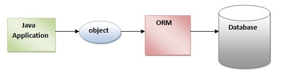

# ORM ,JPA & Hibernate

## Materials
+ Persistence
+ ORM
+ JPA
+ Hibernate
+ JPA vs Hibernate

## Persistence
Almost all applications require persistent data. Persistence is one of the fundamental concepts in application
development. If an information system didn’t preserve data when it was powered off, the system would be of little  
practical use. Object persistence means individual objects can outlive the application process; they can be saved to
a data store and be re-created at a later point in time. When we talk about persistence in Java, we’re normally  
talking about mapping and storing object instances in a database using SQL.

## ORM 
**Object/relational mapping** is the automated (and transparent) persistence of objects in a Java application
to the tables in an SQL database, using metadata that describes the mapping between the classes of the application and
the schema of the SQL database. 

 
In other words, ORM is a programming technique that maps the object to the data stored in the database.

## JPA
A **JPA (Java Persistence API)** is a specification of Java which is used to access, manage, and persist data between 
Java object and relational database. It is considered as a standard approach for Object Relational Mapping.

JPA can be seen as a bridge between object-oriented domain models and relational database systems. Being a 
specification, JPA doesn't perform any operation by itself. Thus, it requires implementation. So, ORM tools like
Hibernate, TopLink, and iBatis implements JPA specifications for data persistence.

## Hibernate
**Hibernate** is a Java framework which is used to store the Java objects in the relational database system. 
It is an open-source, lightweight, ORM (Object Relational Mapping) tool.

Hibernate is an implementation of JPA. So, it follows the common standards provided by the JPA.

## JPA vs Hibernate

| JPA|Hibernate| 
   |:------------------------------------------------:|:----------------------------------------------:
| Java Persistence API (JPA) defines the management of relational data in the Java applications.|Hibernate is an Object-Relational Mapping (ORM) tool which is used to save the state of Java object into the database.|
| It is just a specification. Various ORM tools implement it for data persistence.|It is one of the most frequently used JPA implementation.|
|The **EntityManagerFactory interface** is used to interact with the entity manager factory for the persistence unit. Thus, it provides an entity manager.|It uses **SessionFactory** interface to create Session instances.|
|It uses **EntityManager interface** to create, read, and delete operations for instances of mapped entity classes. This interface interacts with the persistence context.|It uses **Session interface** to create, read, and delete operations for instances of mapped entity classes. It behaves as a runtime interface between a Java application and Hibernate.|
|It uses **Java Persistence Query Language (JPQL)** as an object-oriented query language to perform database operations.| It uses **Hibernate Query Language (HQL)** as an object-oriented query language to perform database operations.|