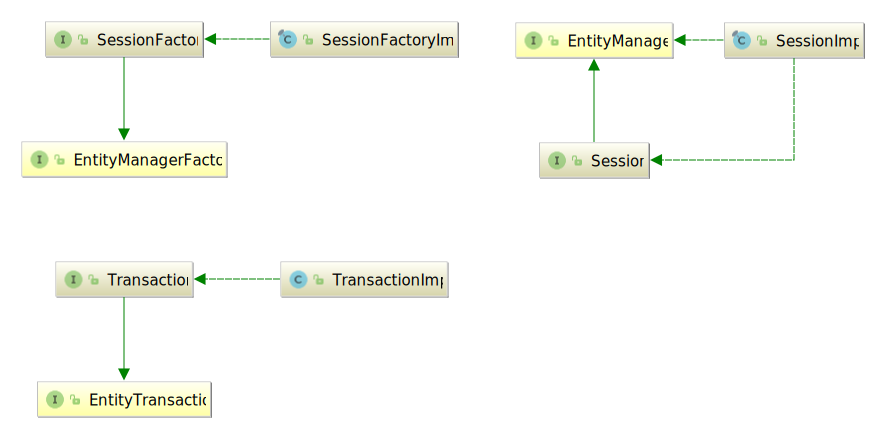
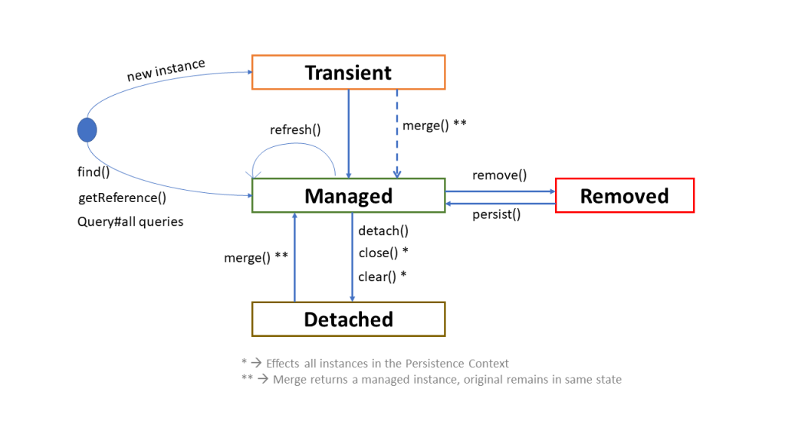

## Materials
+ Overview
+ Main Definitions of Java Persistence API and Hibernate API
+ Entity Object Life Cycle
+ Making entities persistent
+ Loading objects
+ Detaching objects
+ Modifying persistent objects
+ Modifying detached objects
+ Deleting (removing) entities
+ Checking persistent state
+ Cascading entity state transitions
+ Container and Application Managed EntityManager

## Overview

</br>
Hibernate, as an ORM solution, effectively "sits between" the Java application data access layer and the Relational 
Database, as can be seen in the diagram above. The Java application makes use of the Hibernate APIs to load, store, 
query, etc. its domain data. Here we will introduce the essential Hibernate APIs. This will be a brief introduction;
we will discuss these contracts in detail later.

As a JPA provider, Hibernate implements the Java Persistence API specifications and the association between JPA 
interfaces and Hibernate specific implementations can be visualized in the following diagram:

</br>

**EntityManagerFactory** and **EntityManager**  are defined by the JPA standard.
**SessionFactory** and &&Session** are hibernate-specific. The **EntityManager** invokes to hibernate session under the hood.
And if you need some specific features that are not available in the EntityManager, you can obtain the session by calling:
```java
Session session = entityManager.unwrap(Session.class);
```

## Main Definitions of Java Persistence API and Hibernate API
**EntityManagerFactory**</br>
An entity manager factory provides entity manager instances, all instances are configured to connect to the same 
database, to use the same default settings as defined by the particular implementation, etc. You can prepare several 
entity manager factories to access several data stores. This interface is similar to the SessionFactory in native Hibernate.

**EntityManager**</br>
The EntityManager API is used to access a database in a particular unit of work. It is used to create and remove 
persistent entity instances, to find entities by their primary key identity, and to query over all entities. This
interface is similar to the Session in Hibernate. 

**SessionFactory** (org.hibernate.SessionFactory)</br>
A thread-safe (and immutable) representation of the mapping of the application domain model to a database. Acts as a 
factory for org.hibernate.Session instances. The EntityManagerFactory is the JPA equivalent of a SessionFactory and 
basically, those two converge into the same SessionFactory implementation.
A SessionFactory is very expensive to create, so, for any given database, the application should have only one 
associated SessionFactory. The SessionFactory maintains services that Hibernate uses across all Session(s) such as s
second level caches, connection pools, transaction system integrations, etc.

**Session** (org.hibernate.Session)</br>
A single-threaded, short-lived object conceptually modeling a "Unit of Work" (PoEAA). In JPA nomenclature, the Session 
is represented by an EntityManager.
Behind the scenes, the Hibernate Session wraps a JDBC java.sql.Connection and acts as a factory for 
**org.hibernate.Transaction** instances. It maintains a generally "repeatable read" persistence context (first level cache) 
of the application domain model.

**Transaction** (org.hibernate.Transaction)</br>
A single-threaded, short-lived object used by the application to demarcate individual physical transaction boundaries.
EntityTransaction is the JPA equivalent and both act as an abstraction API to isolate the application from the 
underlying transaction system in use (JDBC or JTA).

**Persistence context**</br>
A persistence context is a set of entity instances in which for any persistent entity identity there is a unique entity 
instance. Within the persistence context, the entity instances and their life cycle is managed by a particular entity
manager. The scope of this context can either be the transaction, or an extended unit of work.

## Entity Object Life Cycle
The life cycle of entity objects consists of four states: **Transient**, **Managed**, **Removed** and **Detached**:


* **New or Transient**: an entity is new if it has just been instantiated using the new operator, and it is not associated
with a persistence context. It has no persistent representation in the database and no identifier value has been assigned.
* **Managed (persistent)**: a managed entity instance is an instance with a persistent identity that is currently 
associated with a persistence context.
* **Detached**: the entity instance is an instance with a persistent identity that is no longer associated with a 
persistence context, usually because the persistence context was closed or the instance was evicted from the context.
* **Removed**: a removed entity instance is an instance with a persistent identity, associated with a persistence 
context, but scheduled for removal from the database.

The EntityManager API allows you to change the state of an entity, or in other words, to load and store objects. 

## Making entities persistent 
Once you’ve created a new entity instance (using the standard new operator) it is in new state. You can make it 
**persistent** by associating it to either an **org.hibernate.Session** or a **javax.persistence.EntityManager**.
```java
// Example. Making an entity persistent with JPA

Customer customer = new Customer();
customer.setName("Ivan");
entityManager.persist(customer);


// Example. Making an entity persistent with with Hibernate API

Customer customer = new Customer();
customer.setName("Ivan");
session.save(customer);
```

**org.hibernate.Session** also has a method named **persist** which follows the exact semantics defined in the JPA 
specification for the persist method. It is this **org.hibernate.Session** method to which the Hibernate 
**javax.persistence.EntityManager** implementation delegates.

If the Customer entity type has a generated identifier, the value is associated to the instance when the save or persist
is called. If the identifier is not automatically generated, the manually assigned (usually natural) key value has to be
set on the instance before the save or persist methods are called.


## Loading objects 
It is common to want to obtain an entity along with its data (e.g. like when we need to display it in the UI).
```java
// Example. Obtaining an entity reference with its data initialized with JPA
long customerId = 1;
entityManager.find(Customer.class, new Long( customerId));

// Example. Obtaining an entity reference with its data initialized with Hibernate API
session.get(Customer.class, new Long( customerId));

//Example. Obtaining an entity reference with its data initialized using the byId() Hibernate API
session.byId(Customer.class).load(new Long( customerId));
```
Sometimes we need to obtain a reference to an entity without having to load its data is hugely important. The most 
common case being the need to create an association between an entity and another existing entity.
```java
// Example. Obtaining an entity reference without initializing its data with JPA
Address address = new Address();
address.setDescription("Minsk, Tolbuhina 7");
long customerId = 1;
Customer customer = entityManager.getReference(Customer.class, customerId);  
address.setCustomer(customer);

// Example. Obtaining an entity reference without initializing its data with Hibernate API
Address address = new Address();
address.setDescription("Minsk, Tolbuhina 7");
long customerId = 1;
Customer customer = session.load(Customer.class, customerId);  
address.setCustomer(customer);
```

You can reload an entity instance and its collections at any time using the **refresh()** method. This is useful when 
database triggers are used to initialize some of the properties of the entity. Note that only the entity instance and 
its collections are refreshed unless you specify REFRESH as a cascade style of any associations:
```java
// Example. Refreshing entity state with JPA
entityManager.persist(customer);
entityManager.flush(); // force the SQL insert and triggers to run
entityManager.refresh(customer); //re-read the state (after the trigger executes)

// Example. Refreshing entity state with Hibernate API
Customer customer = new Customer();
customer.setName("Ivan");
session.save(customer);
session.flush(); 
session.refresh(customer);
```

## Detaching objects
We can use **detach()** method. We pass the object to be detached as the parameter to the method:
```java
entityManager.detach(customer);
```

## Modifying persistent objects
Entities in managed/persistent state may be manipulated by the application, and any changes will be automatically
detected and persisted when the persistence context is flushed. There is no need to call a particular method to make 
your modifications persistent.
```java
// Example. Modifying managed state with JPA
Customer customer = entityManage.find(Customer.class, new Long(1) );
customer.setName("Peter");
entityManager.flush();  // changes to customer are automatically detected and persisted

// Example. Modifying managed state with Hibernate API
Customer customer = session.byId( Customer.class ).load( new Long(1) );
customer.setName("Peter");
session.flush();
```

##  Modifying detached objects
Many applications need to retrieve an object in one transaction, send it to the presentation layer for manipulation, 
and later save the changes in a new transaction. There can be significant user think and waiting time between both 
transactions. We can make use of the **merge()** method, for such situations. The merge method helps to bring in the 
modifications made to the detached entity, in the managed entity, if any:
```java
// Example. Merging a detached entity with JPA
Customer customer = entityManage.find(Customer.class, new Long(1) );
entityManager.detach(customer);
customer.setName("Mikle");
customer = entityManager.merge(customer);

// Example. Merging a detached entity with Hibernate API
Customer customer = session.byId( Customer.class ).load( new Long(1) );
//Clear the Session so the person entity becomes detached
session.clear();
customer.setName("Mikle");
customer = (Customer) session.merge(customer);
```

##  Deleting (removing) entities
Entities can also be deleted.
```java
// Example. Deleting an entity with JPA
entityManager.remove(customer);

// Example. Deleting an entity with the Hibernate API
session.delete(customer);
```

## Checking persistent state
An application can verify the state of entities and collections in relation to the persistence context.
```java
// Example. Verifying managed state with JPA
boolean contained = entityManager.contains(customer);

// Example. Verifying managed state with Hibernate API
boolean contained = session.contains(customer);

// Example. Verifying laziness with JPA
PersistenceUnitUtil persistenceUnitUtil = entityManager.getEntityManagerFactory().getPersistenceUnitUtil();
boolean customerInitialized = persistenceUnitUtil.isLoaded(customer);
boolean customerAddressInitialized = persistenceUnitUtil.isLoaded( customer.getAddress());
boolean customerNameInitialized = persistenceUnitUtil.isLoaded(customer, "name");

// Example. Verifying laziness with Hibernate API
boolean customerInitialized = Hibernate.isInitialized(customer);
boolean customerAddressInitialized = Hibernate.isInitialized(customer.getAddress());
boolean customerNameInitialized = Hibernate.isPropertyInitialized(customer, "name");
```

## Cascading entity state transitions

JPA allows you to propagate the state transition from a parent entity to a child. For this purpose, the JPA 
**javax.persistence.CascadeType** defines various cascade types:
* ALL - cascades all entity state transitions.
* PERSIST - cascades the entity persist operation.
* MERGE - cascades the entity merge operation.
* REMOVE - cascades the entity remove operation.
* REFRESH - cascades the entity refresh operation.
* DETACH - cascades the entity detach operation.

Additionally, the CascadeType.ALL will propagate any Hibernate-specific operation, which is defined by the 
org.hibernate.annotations.CascadeType enum:
* SAVE_UPDATE - cascades the entity saveOrUpdate operation.
* REPLICATE - cascades the entity replicate operation.
* LOCK - cascades the entity lock operation.

The following examples will explain some before mentioned cascade operations using the following entities:
```java
@Entity
public class Customer {
    @Id
    @GeneratedValue
    private Long id;
    
    private String name;
    
    @OneToMany(mappedBy = "order", cascade = CascadeType.ALL)
    private List<Order> orders = new ArrayList<>();
    //...
}

@Entity
public class Order {
    @Id
    private Long id;
    
    private Date date;
    
    Decimal amount;
    
    @ManyToOne (fetch = FetchType.LAZY)
    private Customer customer;
    //...
}
```

## Container and Application Managed EntityManager
Basically, there are two types of EntityManager: Container-Managed and Application-Managed.

### Container-Managed EntityManager
Here, the container (such as a JEE Container or Spring) injects the EntityManager in enterprise components.
In other words, the container creates the EntityManager from the EntityManagerFactory:
```java
@PersistenceContext
private EntityManager entityManager;

@Transactional
public T save(T entity) {
    entityManager.persist(entity);
    return entity;
}
```

This also means the container is in charge of beginning the transaction, as well as committing or rolling it back.

### Application-Managed EntityManager
An application-managed entity manager allows you to control the entity manager in application code.
This entity manager is retrieved through the EntityManagerFactory API. In order to create an EntityManager,
we must explicitly call createEntityManager() in the EntityManagerFactory:
```java
protected static EntityManagerFactory entityManagerFactory;

static {
    entityManagerFactory = Persistence.createEntityManagerFactory("com.mjc");
}

public T save(T entity) {
    EntityManager entityManager = entityManagerFactory.createEntityManager();
    try {
        entityManager.getTransaction().begin();
        entityManager.persist(entity);
        entityManager.getTransaction().commit();
    } catch (Exception e) {
        entityManager.getTransaction().rollback();
    }
    entityManager.close();
    return entity;
}
```

In this example we have more control over the flow, but also more responsibilities (e.g. we have to remember to close
the EntityManager, to explicitly call commit and rollback operations).