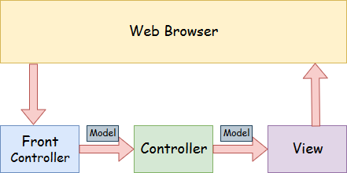

# Spring MVC

## Materials
+ Overview
+ Understanding Spring Web Model-View-Controller
+ Understanding the flow of Spring Web MVC
+ Spring MVC example project

## Overview
A **Spring MVC** is a Java framework which is used to build web applications. It follows the **Model-View-Controller design pattern**. 
It implements all the basic features of a core spring framework like Inversion of Control, Dependency Injection.
A Spring MVC provides an elegant solution to use MVC in spring framework by the help of DispatcherServlet that is completely 
integrated with the Spring IoC container. DispatcherServlet is a class that receives the incoming request and maps it to the right resource such as Controllers, Models and Views.

## Understanding Spring Web Model-View-Controller

- **Model** - A model contains the data of the application. A data can be a single object or a collection of objects.
- **Controller** - A controller contains the business logic of an application. Here, the **@Controller annotation** is used to mark the class as the controller.
- **View** - A view represents the provided information in a particular format. Generally, **JSP+JSTL** is used to create a view page. Although spring also supports other view technologies such as **Apache Velocity, Thymeleaf and FreeMarker**. 
- **Front Controller** - In Spring Web MVC, the DispatcherServlet class works as the front controller. It is responsible to manage the flow of the Spring MVC application.

## Understanding the flow of Spring Web MVC

1. **DispatcherServlet** receives the request.
2. **DispatcherServlet** dispatches the task of selecting an appropriate controller to **HandlerMapping**.
3. **HandlerMapping** selects the controller which is mapped to the incoming request URL and returns the (selected Handler) and **Controller to DispatcherServlet**.
4. **DispatcherServlet** dispatches the task of executing of business logic of **Controller** to **HandlerAdapter**.
5. **HandlerAdapter** calls the business logic process of Controller.
6. **Controller** executes the business logic, sets the processing result in **Model** and returns the logical name of view to **HandlerAdapter**.
7. **DispatcherServlet** dispatches the task of resolving **the View** corresponding to **the View name** to **ViewResolver**. 
8. **ViewResolver** returns **the View** mapped to **View name**.
9. **DispatcherServlet** dispatches the rendering process to returned **View**.
10. **View** renders **Model** data and returns the response.

## Spring MVC example project
https://github.com/eugenp/tutorials/tree/master/spring-web-modules/spring-mvc-basics/src/main/webapp/WEB-INF/view

https://www.baeldung.com/spring-mvc-tutorial

Spring MVC and Java-Based Configuration
https://dzone.com/articles/spring-mvc-and-java-based-configuration-1

Spring MVC using Java based configuration
https://www.geeksforgeeks.org/spring-mvc-using-java-based-configuration/
