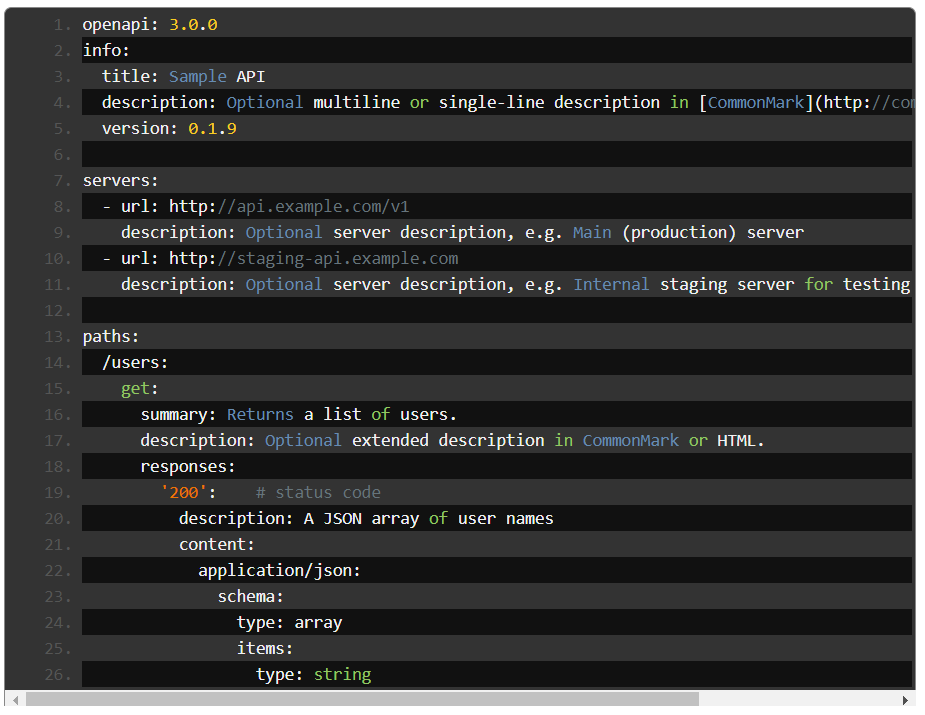
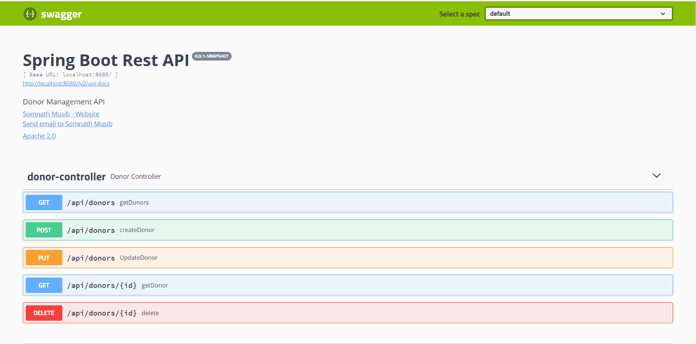
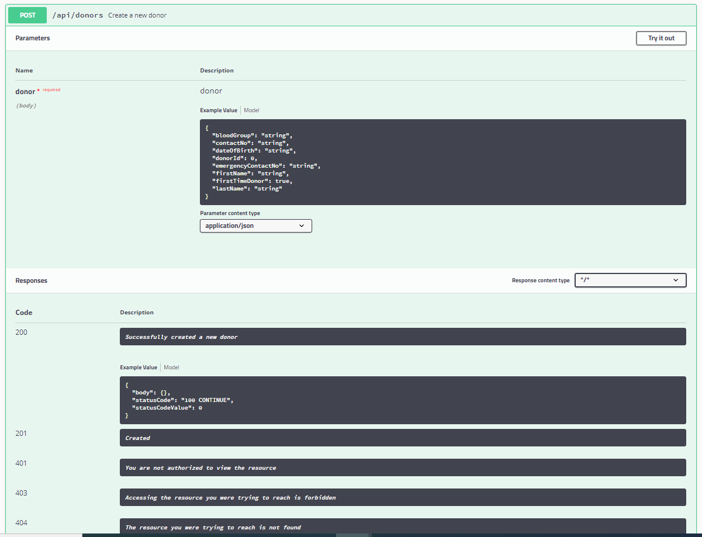
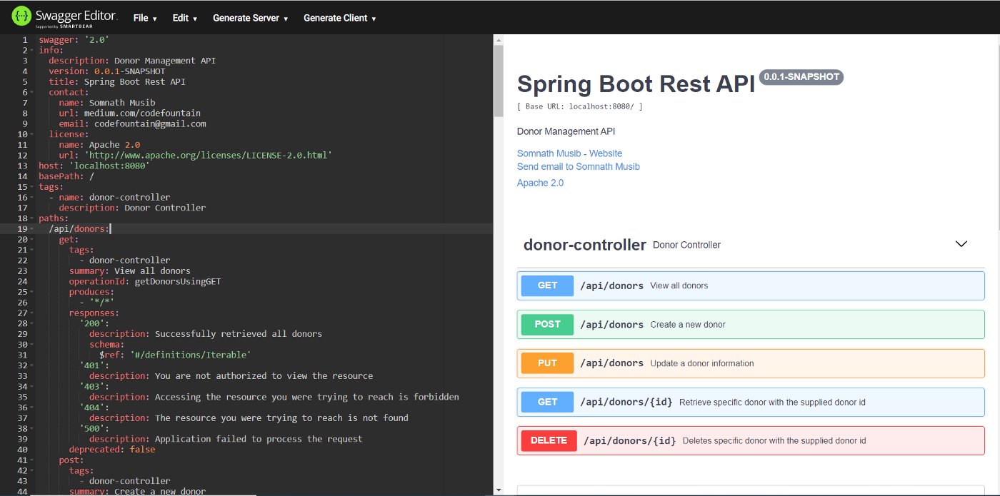

# Swagger and OpenAPI

## Materials
+ Overview
+ OpenAPI Specification
+ Swagger
+ Swagger in Action
+ Swagger Editor
+ Stubbing with Swagger Codegen

## Overview
**Swagger and OpenAPI specification** lets you design and develop REST APIs in an effortless and seamless manner. These specifications allow describing the structure of an entire REST API so that machines can read and mock them.

## OpenAPI Specification
OpenAPI Specification (previously known as Swagger Specification) is an API description format for REST APIs. An OpenAPI specification compatible file allows you to describe a complete REST API. It is generally written in YAML or in the JSON file format.

This file let us:

- Describe all available API endpoints (e.g. /users, /users/{id})
- Operations in the endpoints such as GET /users, POST /user
- Input and Output parameters for each operation
- Authentication mechanisms
- Contact information, API Licence, terms of use and other information

## Swagger
Swagger is a set of open-source tools built around the OpenAPI Specification that can help you to design, build, document and consume REST APIs. The ability of APIs to describe their own structure is the root of all awesomeness in Swagger. Note that Swagger not only helps you to design and document REST APIs, it also lets you build (Server Stub) and Consume (Rest Clients) REST APIs.

The major Swagger tools include:

- **Swagger Editor** — browser-based editor where one can write OpenAPI specification
- **Swagger UI** — renders OpenAPI specs as interactive API documentation
- **Swagger Codegen** — generates server stubs and client libraries from an OpenAPI specification

Here is a sample OpenAPI document in the Swagger Editor:



## Swagger in Action

To enable Swagger in a RESTful application you should add the following dependencies:
```groovy
implementation group: 'io.springfox', name: 'springfox-swagger2', version: '3.0.0'
implementation group: 'io.springfox', name: 'springfox-swagger-ui', version: '3.0.0'
```

Add Swagger configuration in a separate configuration class:
```Java
@Configuration
@EnableSwagger2
public class SwaggerConfiguration {

    @Bean
    public Docket api(){
        return new Docket(DocumentationType.SWAGGER_2)
                .select()
                .apis(RequestHandlerSelectors.basePackage("mjc.newsapplication.controller"))
                .paths(PathSelectors.any())
                .build().apiInfo(apiEndPointInfo());
    }

    public ApiInfo apiEndPointInfo(){
        return new ApiInfoBuilder().title("Application Rest API")
                .description("News Application API")
                .contact(new Contact("MJC Supervisor", "mjc/finalexam", "mjc@epam.com"))
                .license("Apache 2.0")
                .licenseUrl("http://www.apache.org/licenses/LICENSE-2.0.html")
                .version("0.0.1-SNAPSHOT")
                .build();
    }
}
```
Here, You have added metadata information about the REST API such as API name, author, website, license and so on. You have also instructed Swagger to only generate documentation for the components present in the mjc.newsapplication.controller package.

Since we have enabled Swagger, let us see the documentation of our API endpoints done by Swagger. This is rendered through Swagger UI in the following link:

http://localhost:8080/swagger-ui.html#/news-controller



Here, Swagger has put together the following information:

- Document metadata (API name, license, website, contact and so on)
- All REST endpoints with default information it can infer from code. Note that endpoint descriptions are method names

These are the default information. If you want, you can provide a detailed description and information about the endpoints and operations.

## Documenting Rest Controller
Now Let's document the REST controller of your application explicitly. Swagger provides several annotations to add documentation metadata that it pulls while generating the documentation.

For each of the REST endpoint and its associated operations, You can provide ApiOperation and their various responses with ApiResponses annotations.

```Java
@RestController
@RequestMapping("/api/v1/news")
@Api(produces = "application/json", value = "Operations for creating, updating, retrieving and deleting news in the application")
public class NewsController {

    @Autowired
    private NewsService newsService;

    @PostMapping
    @ApiOperation(value = "Create a piece of news", response = News.class)
    @ApiResponses(value = {
            @ApiResponse(code = 201, message = "Successfully created a piece of news"),
            @ApiResponse(code = 401, message = "You are not authorized to view the resource"),
            @ApiResponse(code = 403, message = "Accessing the resource you were trying to reach is forbidden"),
            @ApiResponse(code = 404, message = "The resource you were trying to reach is not found"),
            @ApiResponse(code = 500, message = "Application failed to process the request")
    }
    )
    @ResponseStatus(HttpStatus.CREATED)
    public News createNews(@RequestBody News news){         
            return newsService.save(news);
    }

    @GetMapping
    @ApiOperation(value = "View all news", response = List.class)
    @ApiResponses(value = {
            @ApiResponse(code = 200, message = "Successfully retrieved all news"),
            @ApiResponse(code = 401, message = "You are not authorized to view the resource"),
            @ApiResponse(code = 403, message = "Accessing the resource you were trying to reach is forbidden"),
            @ApiResponse(code = 404, message = "The resource you were trying to reach is not found"),
            @ApiResponse(code = 500, message = "Application failed to process the request")
    }
    )
    public List<News> getNews(){
        return newsService.findAll();
    }

    @GetMapping("/{id}")
    @ApiOperation(value = "Retrieve specific news with the supplied id", response = News.class)
    @ApiResponses(value = {
            @ApiResponse(code = 200, message = "Successfully retrieved the news with the supplied id"),
            @ApiResponse(code = 401, message = "You are not authorized to view the resource"),
            @ApiResponse(code = 403, message = "Accessing the resource you were trying to reach is forbidden"),
            @ApiResponse(code = 404, message = "The resource you were trying to reach is not found"),
            @ApiResponse(code = 500, message = "Application failed to process the request")
    }
    )
    public News getNews(@PathVariable("id") Long id){
        return newsService.findById(id);
    }

    @PutMapping("/{id}")
    @ApiOperation(value = "Update a piece of news information", response = News.class)
    @ApiResponses(value = {
            @ApiResponse(code = 200, message = "Successfully updated news information"),
            @ApiResponse(code = 401, message = "You are not authorized to view the resource"),
            @ApiResponse(code = 403, message = "Accessing the resource you were trying to reach is forbidden"),
            @ApiResponse(code = 404, message = "The resource you were trying to reach is not found"),
            @ApiResponse(code = 500, message = "Application failed to process the request")
    }
    )
    public News UpdateNews(@PathVariable("id") Long id, @RequestBody News news){
        return newsService.update(news);
    }

    @DeleteMapping("/{id}")
    @ApiOperation(value = "Deletes specific news with the supplied id")
    @ApiResponses(value = {
            @ApiResponse(code = 200, message = "Successfully deletes the specific news"),
            @ApiResponse(code = 401, message = "You are not authorized to view the resource"),
            @ApiResponse(code = 403, message = "Accessing the resource you were trying to reach is forbidden"),
            @ApiResponse(code = 404, message = "The resource you were trying to reach is not found"),
            @ApiResponse(code = 500, message = "Application failed to process the request")
    }
    )
    @ResponseStatus(HttpStatus.NO_CONTENT)
    public void delete(@PathVariable("id") Long id){
        newsService.deleteById(id);
    }
}
```
Now, restart the application and access the URL:

http://localhost:8080/swagger-ui.html#/news-controller

Here, you can see the same REST API documentation as above, so you can find here the information about response with HTTP response codes:



## Swagger Editor
Swagger generates the documentation in the JSON file format adhering to the OpenAPI specification. We can share this JSON file with the consumers and they can read the endpoint information, generate client and server stubs.

REST API documentation of your application can be accessed through the following URL:

http://localhost:8080/v2/api-docs

This JSON document conforms OpenAPI specification and can be accessed through Swagger Editor as shown below:



Here, you can view the description of your application API endpoints and all other related metadata such as model structure, data types and so on.

## Stubbing with Swagger Codegen
Swagger codegen let us generate server stub and client SDKs from a supplied OpenAPI document. Swagger codegen presently supports the following server (Over 20 languages) and client SDK generation (Over 40 languages):

Swagger codegen can be access through Command Line Interface (codegen-cli) or the maven\gradle plugin. To access codegen CLI jar file you can download the jar from here (https://search.maven.org/classic/remotecontent?filepath=io/swagger/swagger-codegen-cli/2.2.3/swagger-codegen-cli-2.2.3.jar).

Using the jar you can generate a Server stub from the OpenAPI document. This stub can be used for mocking and testing the endpoints. This is a common scenario when the provider might have shared the API documentation but the consumer does not have access to the provider infrastructure. 