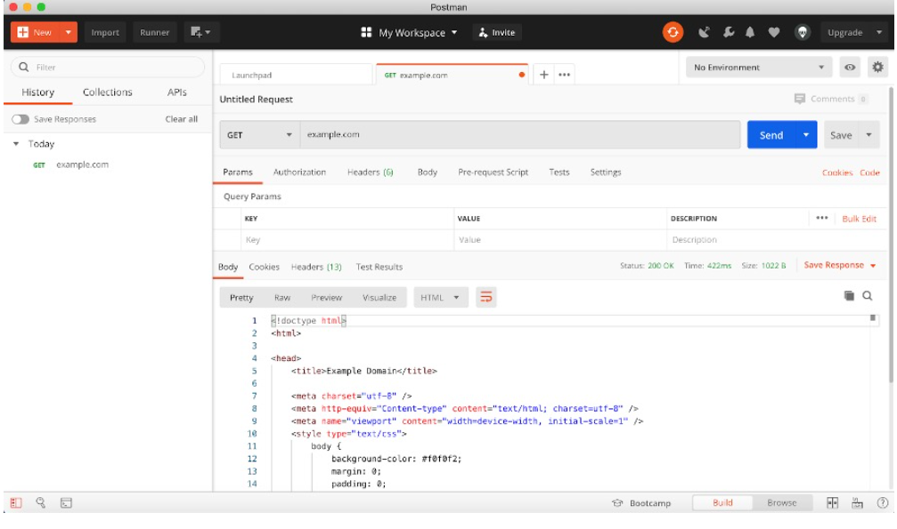

# Postman for testing REST API

Postman is designed to check requests from the client to the server and receive a response from the back-end with a great user interface. 

Postman provides a graphical user interface for generating and validating requests.

Postman-level automation allows you to perform the following test steps:

* Saving Tests
* Create test collections
* Postman Standard Tests
* Modify tests for yourself in the old and new version
* Get data from object tree JSON, XML
* Manage environment variables
* Run one test several times
* Download test data from file
* Create a lot of data with unique values

It is also very easy and understandable to use the menu to select the type of request.

Postman has the ability to write a testing script. JavaScript is used for this. On the Postman documentation site, there are very clear and varied examples of writing test scripts.
Using JavaScript you can automate the verification of the most common requests to test the API in your project.

Postman is widely used for testing complex REST API. Any service that works with HTTP requests can be fully tested with this tool. 

More information here https://www.baeldung.com/postman-testing-collections.