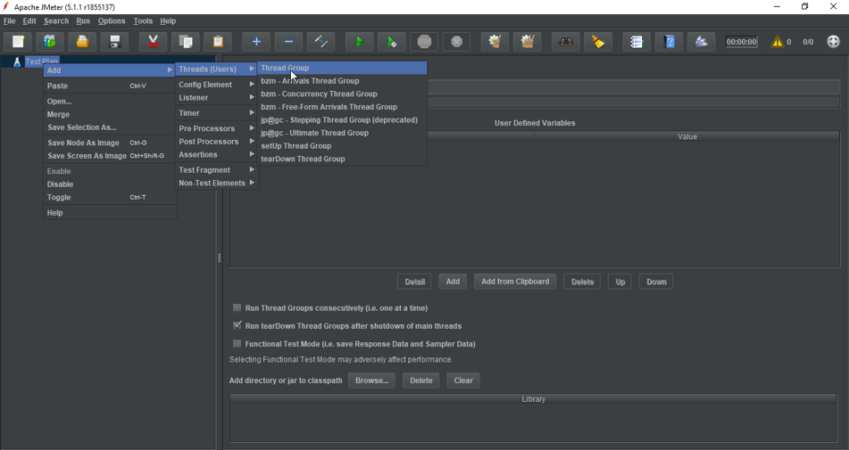
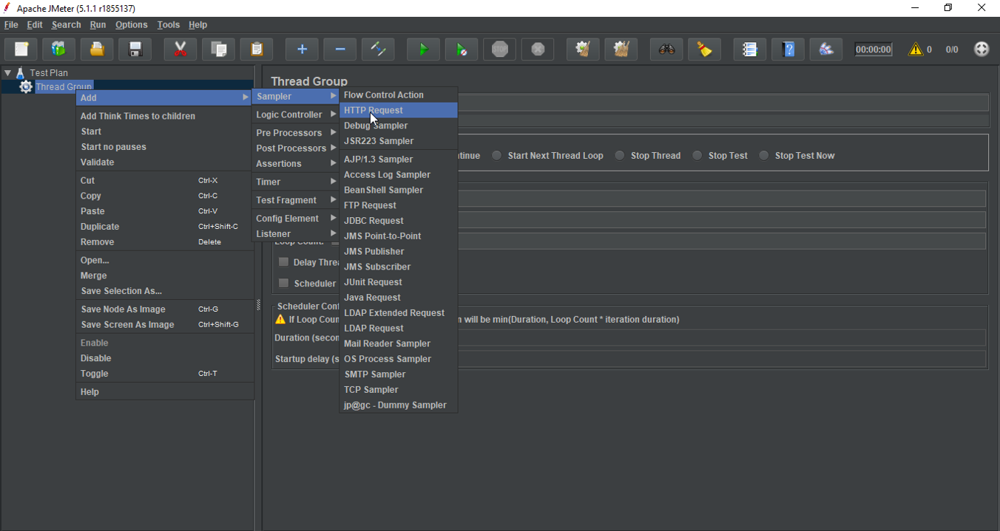
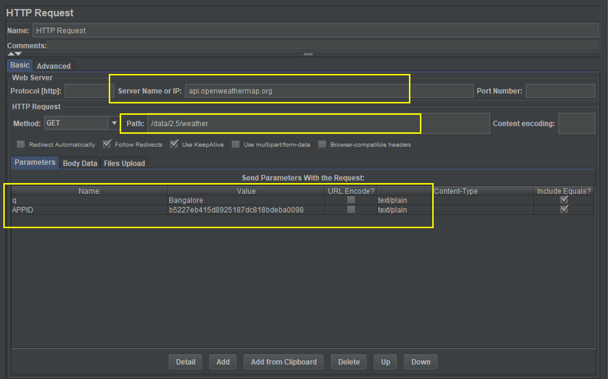
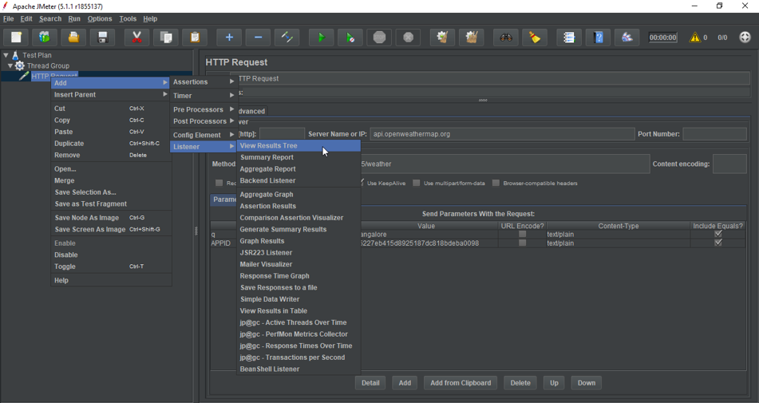
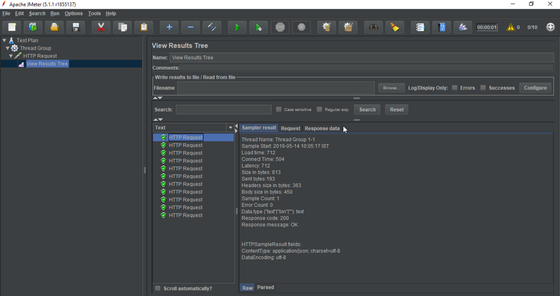

# JMeter for testing REST API

Apache JMeter is one of the most popular, open-source software for REST API and performance testing. In order to Perform API Testing in JMeter, you have to download and install the tool in your system.

## Steps to Perform API Testing in JMeter
* Firstly, you have to start your JMeter and select the **Test Plan**.
* Next, Right click on the Test Plan and add a **Thread Group**.

* Then you have to add **HTTP Request** and enter the Server name or IP of your API and set the Path and Parameters. Right click on **Thread Group**, select Sampler and add **HTTP Request**.

* Next, you can search for **REST APIs** that are freely available on the internet. Copy the **Server Name, Path, and Parameters** for that particular API.

* Once you have the API, the server name, path, and parameters. Copy the values in the **HTTP Reques**t of **JMeter Test Plan**.

* Now, add a **Listener** to view the results of your Test. Right click on **HTTP Request**, select **Listeners** and add **View Results Tree** or **View Results in Table**.

The final step is to just Run your **Test Plan**. You can increase the number of **Threads** in order to increase the Load on your API. The Test Result will show the **Request and Response** for the **HTTP Request server**. You can see the exact weather values in the **Response Data section**.

With these steps, you have successfully completed your REST API Testing. I hope you understood what is API and how you can test your API in JMeter.

More information here https://www.baeldung.com/jmeter.

