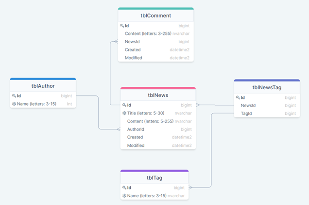

# REST API Advanced

## Materials

1. [Spring Boot Init](https://start.spring.io/)
2. [Spring Boot tutorial](https://spring.io/guides/gs/rest-service/)
3. [REST API Design: Filtering, Sorting, and Pagination](https://www.moesif.com/blog/technical/api-design/REST-API-Design-Filtering-Sorting-and-Pagination/)
4. [REST Pagination in Spring](https://www.baeldung.com/rest-api-pagination-in-spring/)
5. [HATEOAS with Spring](https://spring.io/guides/gs/rest-hateoas/)
6. [What is ORM](https://www.educba.com/what-is-orm/)
7. [Java persistence API](https://www.vogella.com/tutorials/JavaPersistenceAPI/article.html)
8. [Spring transaction management](https://docs.spring.io/spring/docs/4.2.x/spring-framework-reference/html/transaction.html)
9. [Auditing with JPA](https://www.baeldung.com/database-auditing-jpa#auditing)
10. [Documenting a Spring REST API Using OpenAPI 3.0](https://www.baeldung.com/spring-rest-openapi-documentation)

## Practice

#### Recommended Timeline
The recommended timeline for the whole module is 2 weeks.

### Task

#### Part 1

##### Business requirements

1. Develop web service for News Management system with the following entities:
   
   *  - unique value
   * All Name, Title and Content fields are required
   * Created, Modified – have ISO 8601 format [wiki: ISO_8601](https://en.wikipedia.org/wiki/ISO_8601). Example: 2018-08-29T06:12:15.156. More discussion here: [stackoverflow: how to get iso 8601](https://stackoverflow.com/questions/3914404/how-to-get-current-moment-in-iso-8601-format-with-date-hour-and-minute).
     
2. The system should expose REST APIs to perform the following operations:
   * CRUD operations ([what is CRUD](https://en.wikipedia.org/wiki/Create,_read,_update_and_delete)) for News and Comment. If new tags and authors are passed during creation/modification – they should be created in the DB. For update operation – update only fields, that pass in request, others should not be updated. Batch insert is out of scope.
   * Get News:
     * get all
     * by Id
     * search (all params are optional and can be used in conjunction):
       * by tag names and tag ids (many tags)
       * by author name (one author)
       * by part of Title
       * by part of Content
     * sort by Created, Modified Asc/Desc. Default: Created Desc
   * Get Comments:
     * by News Id (URL example: /news/{newsId}/comments)
     * by Id
     * sort by Created, Modified Asc/Desc. Default: Created Desc
   * CRD operations for Tag, and Author
   * Get Tags and Authors:
     * get all
     * by Id
     * by part Name
     * by News Id (URL examples:\
           /news/{newsId}/tags - *should return tags collection*\
           /news/{newsId}/author - *should return 1 author*)
   * Get authors with amount of written news. Sort by news amount Desc.
   * Optional:  load Content of News through separate operation
3. Pagination should be implemented for all GET endpoints. Please, create a flexible and non-erroneous solution. Handle all exceptional cases.
4. Request URL, params and body should be validated.
   Return error response if user:
   * try to call nonexistent URL
   * passes null or empty value into required field or doesn’t specify it at all
   * passes value with invalid format
   * Optional: passes invalid param names or invalid constant values. For example:
     * instead of GET /news?title=breaking user accidently wrote /news?tile=breaking
     * instead of GET /news?sortBy=Created|ASC user accidently wrote /news?sortBy=Cread|ASC or /news?sortBy=Created|AC
   Register should be ignored for all constant values(e.g. asC, deSc) and all existed param names(e.g. /news?tITle=breaking).
   If there are empty characters at the beginning or end of the value, these characters should  be ignored during execution.
5. Support HATEOAS on REST endpoints.
6. Use Swagger to document RESTful API.

#### General requirements

1. Code should be clean and should not contain any “developer-purpose” constructions.
2. App should be designed and written with respect to OOD and SOLID principles.
3. Clear layered structure should be used with responsibilities of each application layer defined.
4. All business logic should be written in the service layer: mapping model to DTO and vice versa, transactions, validation, etc.
5. Use separate classes for mapping from ResultSet to model.
6. Place queries in constants (if they exist).
7. JSON should be used as a format for client-server communication messages. Optional: support XML.
8. Convenient error/exception handling mechanism should be implemented: all errors should be meaningful and localized (En/Ru) on backend side. Example: handle 404 error:

        • HTTP Status: 404
        • response body    
        • {
        • “errorMessage”: “Requested resource not found (id = 55)”,
        • “errorCode”: 40401
        • }

    where *errorCode” is your custom code (it can be based on http status and requested resource - certificate or tag)
9. Abstraction should be used everywhere to avoid code duplication.
10. Application should be covered with unit tests.
11. Use REST-Assured for testing REST API.

#### Part 2

This submodule covers following topics:
1. ORM
2. JPA & Hibernate
3. Transactions

ORM stands for **Object Relational Mapping**. It’s a bit of an abstract concept – but basically it’s a technique that allows us to query and change data from the database in an object oriented way. ORMs provide a high-level abstraction upon a relational database that allows a developer to write Java code instead of SQL to create, read, update and delete data and schemas in their database. Developers can use the programming language they are comfortable with to work with a database instead of writing SQL statements or stored procedures.\
A JPA **(Java Persistence API)** is a specification of Java which is used to access, manage, and persist data between Java object and relational database. It is considered as a standard approach for Object Relational Mapping. JPA can be seen as a bridge between object-oriented domain models and relational database systems. Being a specification, JPA doesn't perform any operation by itself. Thus, it requires implementation. So, ORM tools like Hibernate, TopLink, and iBatis implements JPA specifications for data persistence.\
A **transaction** usually means a sequence of information exchange and related work (such as database updating) that is treated as a unit for the purposes of satisfying a request and for ensuring database integrity. For a transaction to be completed and database changes to made permanent, a transaction has to be completed in its entirety.

##### Application requirements

1. Gradle, latest version. Multi-module project.
2. Application packages root: com.mjc.school.
3. Hibernate should be used as a JPA implementation for data access.
4. Spring Framework & Spring Boot, the latest version.
5. Spring Transaction should be used in all necessary areas of the application.
6. Java Code Convention is mandatory.
7. Application restriction: Spring Data

# Demo
## Practical part

1. Application should be deployed before demo.
2. Generate for a demo at least
    - 1000 authors
    - 1000 tags
    - 1000 comments
    - 10’000 news (should be linked with tags, authors, comments)
      All values should look like more -or-less meaningful: random words, but not random letters
3. Demonstrate API using Postman tool. Prepare for demo Postman collection with APIs.
4. (Optional) Build & run application using command line

## Theoretical part

Mentee should be able to answer theoretical and practical questions during demo session.

## Extra Materials

1. [Spring Boot reference](https://spring.io/projects/spring-boot/)
2. [Building a spring-boot based application from scratch](https://medium.com/@lastbyte/building-a-spring-boot-based-application-from-scratch-41a4f6c9e2a9)
3. [REST API — What Is HATEOAS?](https://dzone.com/articles/rest-api-what-is-hateoas)
4. [Richardson Maturity Model](https://martinfowler.com/articles/richardsonMaturityModel.html)
5. [What Is the Difference Between SQL and Object-Relational Mapping (ORM)?](https://www.kdnuggets.com/2022/02/difference-sql-object-relational-mapping-orm.html)
6. [JPA vs Hibernate](https://www.javatpoint.com/jpa-vs-hibernate)
7. [ACID Properties of transactions](https://www.geeksforgeeks.org/acid-properties-in-dbms/)
8. [Transaction Isolation Levels](https://www.geeksforgeeks.org/transaction-isolation-levels-dbms/)
