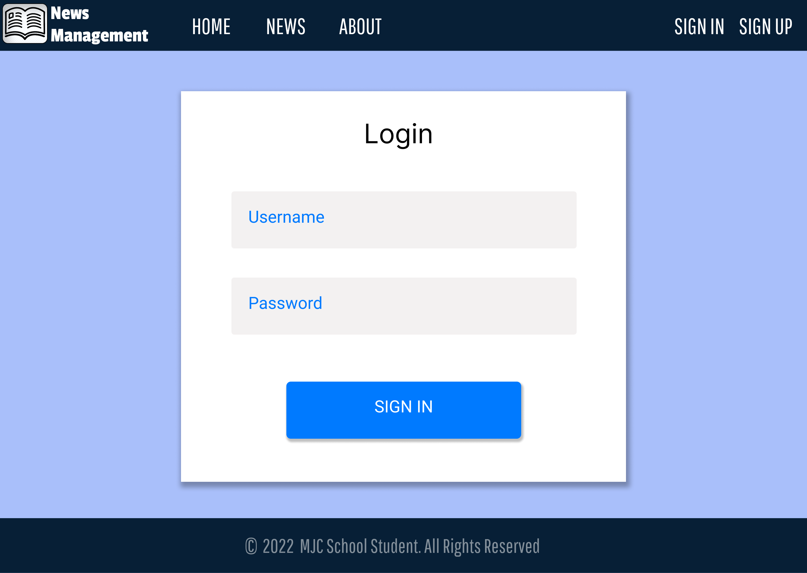
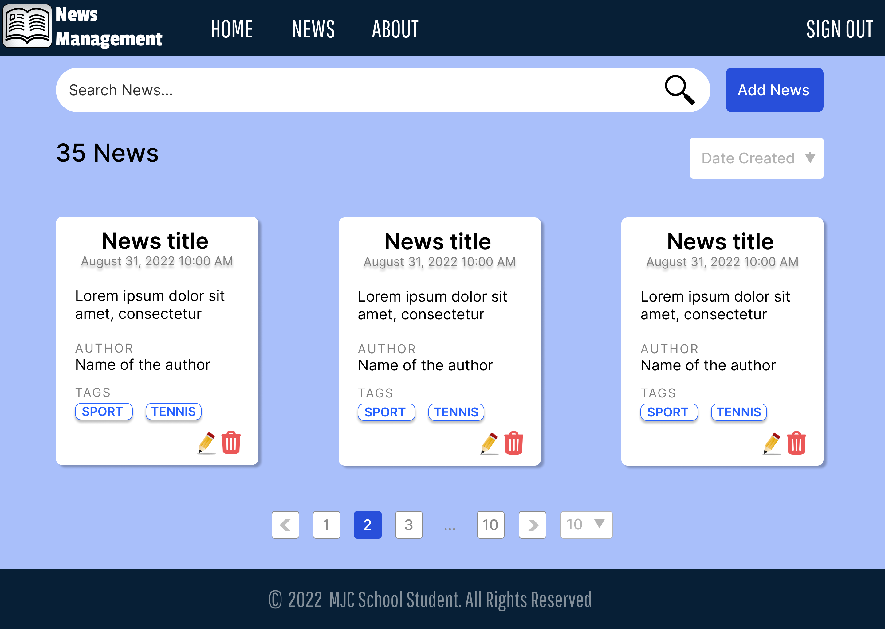
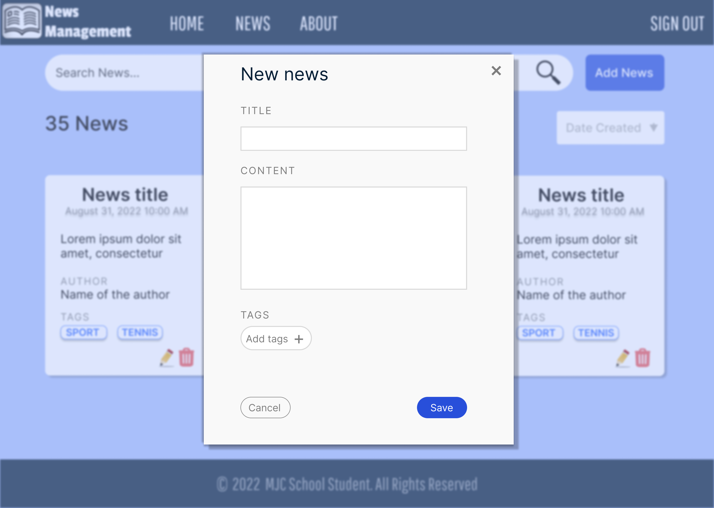
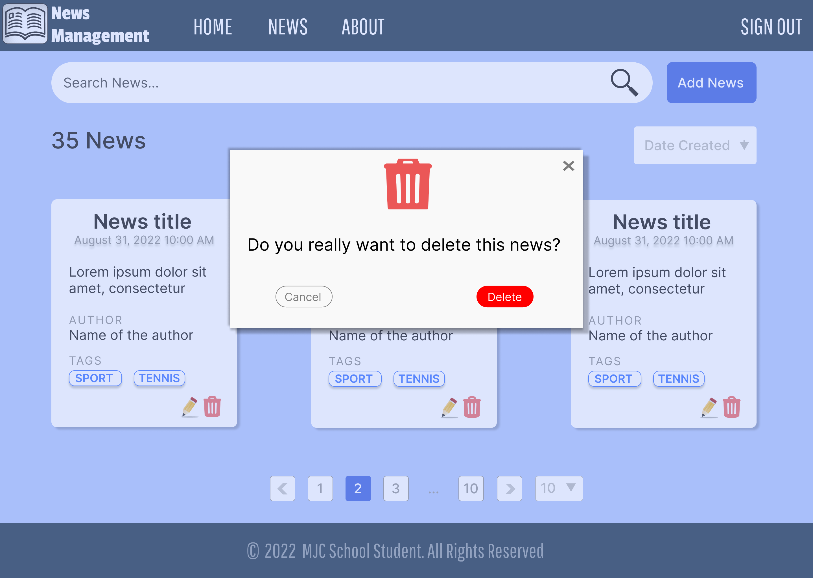

# Modern UI - React

## Materials

1. [Getting started with web](https://developer.mozilla.org/en-US/docs/Learn/Getting_started_with_the_web)
2. [Website overview](https://developer.mozilla.org/en-US/docs/Learn/Getting_started_with_the_web/What_will_your_website_look_like)
3. [HTML basics](https://developer.mozilla.org/en-US/docs/Learn/Getting_started_with_the_web/HTML_basics)
4. [CSS basics](https://developer.mozilla.org/en-US/docs/Learn/Getting_started_with_the_web/CSS_basics)
5. [JavaScript basics](https://developer.mozilla.org/en-US/docs/Learn/Getting_started_with_the_web/JavaScript_basics)
6. [React Bootstrap](https://react-bootstrap.github.io/getting-started/introduction/)
7. [React Bootstrap tutorial](https://www.educative.io/blog/react-bootstrap-tutorial)
8. [Redux tutorial](https://daveceddia.com/redux-tutorial/)

## Practice

### Timeline
The recommended timeline for the whole module is 3 weeks.

### Getting started

React is one of the most popular JavaScript libraries for front-end web applications.\
Facebook has created a handy tool called [Create React App](https://create-react-app.dev/) that makes it easy to setup a React project with just a simple command! To get started, make sure you have a recent version of Node installed on your machine.

Key concepts:
* **Components** let you split the page into independent and reusable parts.\
  In React, there are two types of components that you can use: Functional Components and Class Components (typically used when there are more advanced user interactions, like forms).
* Functional components can accept arguments, similar to JavaScript functions. These arguments are called **props**, and represent an object.
* **State** is an object that is added as a property in class components. It allows components to manage and change their data.
* **Redux** is a small JavaScript library that was created to make state management predictable, providing a single state container and strict rules on how state can be changed.
  Having a single state container makes it easier to manage the state of your application, as you can access and change the data from any component that needs it, without having to pass down the data.

1. Run the following commands in the Terminal to create and start a React app called "my-app":
```
  npx create-react-app my-app
  cd my-app
  npm start
```
This will install all the required dependencies, configure and start the project on *localhost:3000*.

2. Complete [tutorial](https://reactjs.org/tutorial/tutorial.html) to gain fundamental knowledge in building React applications.

3. React application usually contains not only React dependencies. Some third party libraries may be useful for solving specific problems. You are not limited to this set of technologies, but this is a recommended setup:
   - Routing in application\
     Transitions between pages handled by a [special component](https://reacttraining.com/react-router/native/guides/quick-start).
   - Data fetching\
     HTTP requests to server performed using [FetchAPI](https://developer.mozilla.org/en-US/docs/Web/API/Fetch_API/Using_Fetch)
   - Site theme & UI components\
     [Bootstrap](https://getbootstrap.com/) or React Versions ([React Bootstrap](https://github.com/react-bootstrap/react-bootstrap) or [Reactstrap](https://reactstrap.github.io/?path=/story/home-installation--page))
   - Data storage in UI application\
     [Redux](https://redux.js.org/)

### Task
#### Application requirements

1. EcmaScript, [JSX](https://reactjs.org/docs/introducing-jsx.html)
2. Development Environment: Visual Studio Code or any
4. The Latest version of React 
5. Node & NPM
6. HTML5
7. The Latest version of CSS

#### General requirements

1. Include UI in an executable jar. Running on local dev server only for development purposes. 
2. Bootstrap can be used.
3. Refreshing of a page should not affect pagination.
4. Duplication of browser’s tab should lead to exactly the same page (pagination, etc.). Modals may be hidden. Local storage may be used only for security and profile info purposes. All search state should be in url. 
5. Header/footer should be static and be stuck to the top/bottom of the page.
6. Code should be readable, easy maintainable and reusable.
7. Follow component-based application structure.
8. Screenshots of working application should be attached to a merge request. 
9. In scope of this task backend may be changed a bit, but without rewriting significant amount of code. 

### Mockups (Admin mode)
Below are sample mockups, you are free to make minor changes.

1. _Login page_\
Follow this [tutorial](https://saasitive.com/tutorial/react-routing-components-signup-login/) to create a login page with React Bootstrap and connect Redux to it



- Header should be fixed at the top (website logo is optional). 
- Footer should be fixed at the bottom. 
- Username and password are input fields.
- "Sign in" button. When sign in is successful, redirect to "News page". The Sign In/Sign Up links should turn "Sign Out".
- Input fields should be validated, and inline error messages should be displayed according to the following rules:  
   - No blank fields
   - Login field length must not be less than 3 characters and greater than 30 characters 
   - Password length must not be less than 4 characters and greater than 30 characters 

2. _News page_ 



- Search bar to look for the news. User can filter data by tags, title, description.\
For example, `fluffy #(little cat) #(fun)` - find news that correspond all statements below:
   * have tags "little cat" and "fun"
   * contain "fluffy" in title or content.
- "Add News" button opens "New News" modal.
- Sorting type can be set in the "Date Created" drop-down list.
- The total amount of news should be displayed.
- All news should be displayed as cards. 
- Pressing "pencil" icon leads to "Edit News" modal.
- Pressing "basket" icon leads to "Delete News" modal.
- Page size. Values: 10, 20, 50.
- Paging. First and last page should be always accessible. A current page is highlighted.
- If the server returns an error, error message should be displayed.
- After successful sign out, go to "Login page".

3. _Add new news_



- Create your own component or reuse something like [react-tag-input](https://www.npmjs.com/package/react-tag-input) for adding tags functionality. 
- Title and content fields are required and should be validated according to the following rules:  
     * No blank fields
     * Title field must not be less than 6 and greater than 30 characters
     * Content field must not be less than 12 and greater than 1000 characters
     * Tags are optional, but tag name should be not less than 3 and greater than 15 characters. 
     * After submitting, the modal should be hidden and the data should be reloaded. This action will reload the current page. 
     * In case of error show inline error.

4. _Delete certificate_



- Modal confirmation. If user click "Delete", the news must be deleted, modal hidden and data reloaded.

## Demo
### Practical part

Mentee should be able to demonstrate his test project.

### Theoretical part

Mentee should be able to answer questions during demo session.

## Extra Materials
1. [A short react bootstrap tutorial](https://www.youtube.com/watch?v=8pKjULHzs0s)
2. [Publishing site](https://developer.mozilla.org/en-US/docs/Learn/Getting_started_with_the_web/Publishing_your_website)
