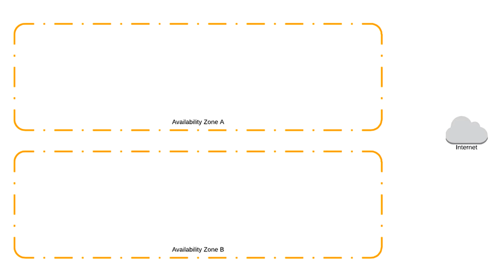
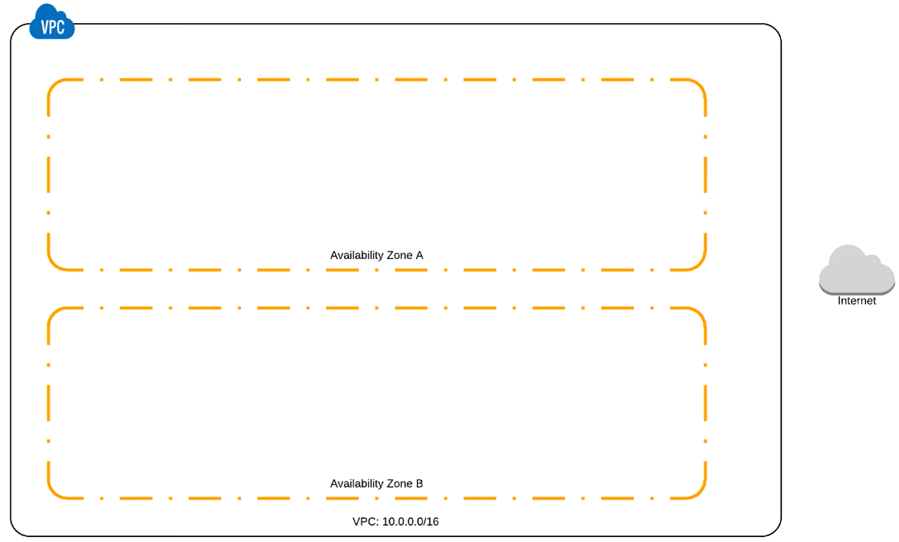
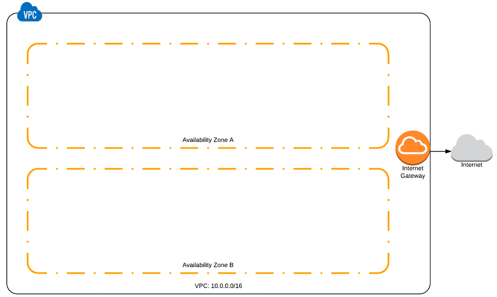
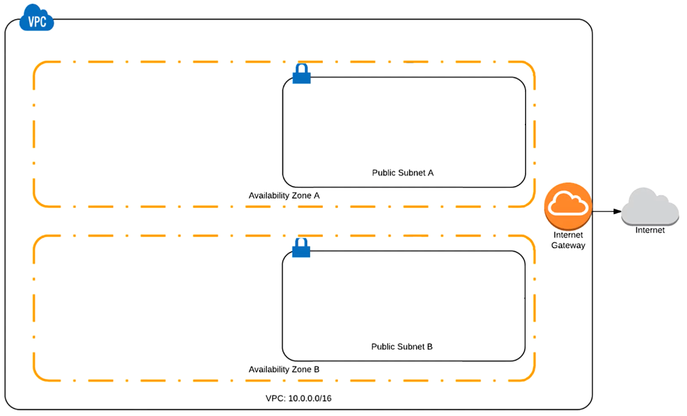
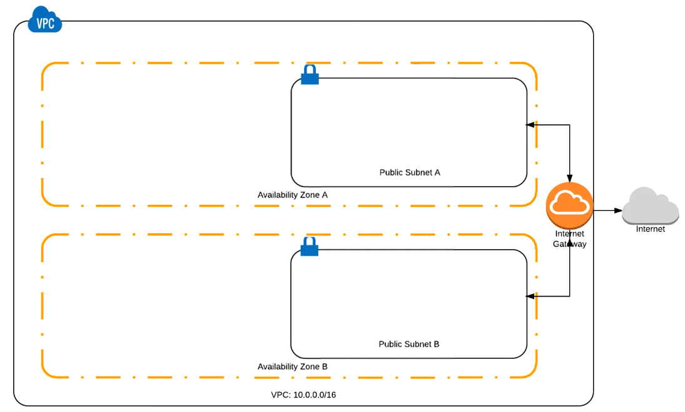
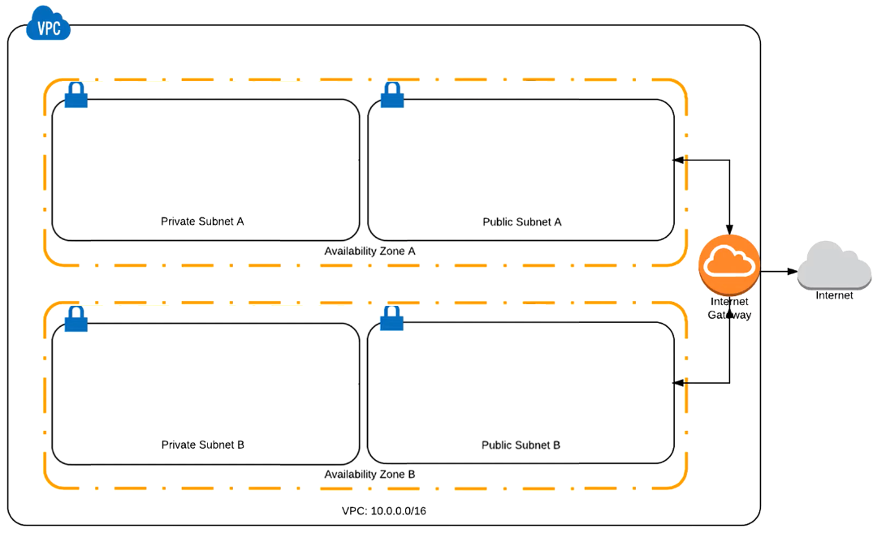
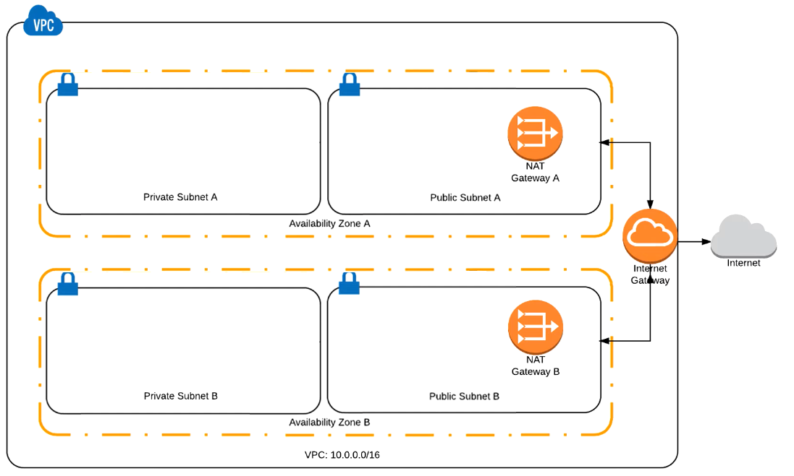

# AWS VPC

## Solution

### First step

Here you can see the default step that requires no additional configuration 
You have some AZs and the Internet access in any region by default

### Second step

Next, you're going to create a vpc itself with specified CIDR block (10.0.0.0/16)

* Go to the VPC service in Console
* Click *Create VPC*
* Enter specified IPv4 CIDR Block (it isn't going to be used IPv6 during the module since it's supposed to be used as an internal net)
* Tenancy leave default since no dedicated hardware required during this module

### Third step

Next, introduce an Internet gateway in order to enable the net access the Internet

* Go to the *Internet gateways* tab
* Click *Create Internet Gateway*
* Give it a proper name (the IG is currently detached, so it's necessary to attach it to the net)
* Click *Attach to VPC* (there all the VPCs without IGs attached to them are listed)

### Fourth step

Add some subnets to the net. First create public ones

* Go to the *Subnets* tab
* Click *Create Subnet*
* Give it a proper name
* Choose our net as VPC
* Choose Availability Zone 
* Enter a CIDR Block (this should be a subset of the net CIDR Block's available IPs for instance use 10.0.12.0/24)
* Proceed with the B subnet the same way (pay attention to choose another AZ per a picture, and use for instance 10.0.22.0/24)

Note that we haven't specified that the subnets are public during the creation process, so see that *Auto-assign Public IP* equals to *No* 
Click *Modify auto-assign IP settings* and enable publicity of the subnet 
Ensure to do this to both subnets 
By doing so, we let the net know that all the instances launching there are going to be auto-assigned with public IP 

Pay attention to the route table 
By default, what is written there literally says that all the packages aimed to the net's IP range aren't able to go beyond 
It has to be modified in the next step 

### Fifth step

Configure routes so that all the packages routed to the Internet will go to the Internet because as for now it's not like that 

* Click *Edit*
* Click *Add another route*
* Destination is 0.0.0.0/0, target is the Internet gateway you created earlier
* Save this and add a proper name

### Sixth step

Add private subnets

The way it's created is almost the same 
* CIDR Block for private subnet A is for instance 10.0.13.0/24
* CIDR Block for private subnet B is for instance 10.0.23.0/24

See that by default these subnets are attached with route table that has been created before 

Create another route table for the subnets and attach it to each other
* Click *Create Route Table*
* Give it a proper name
* For now leave it as it
* Attach it to an appropriate private subnet
* Do the same for another route table with according name

### Seventh step

End in adding NAT gateways 

* Fo to the *NAT Gateways* tab
* Click *Create NAT Gateway*
* Enter the public subnet A's name
* Next, allocate a new elastic IP address
* Do the same and create one more NAT in the B public subnet
* Get back to the route tables for private subnets
  * All the traffic for the Internet(0.0.0.0/0) should be routed via NAT, so add NAT gateways IP addresses for each other - for route table A add IP address of a NAT housed in the A subnet and for the B one add IP address of a NAT housed in the B subnet

In order to ensure you launched your net correctly you can run some instances within each if the subnets and try to log in to the instances and ping some web pages 