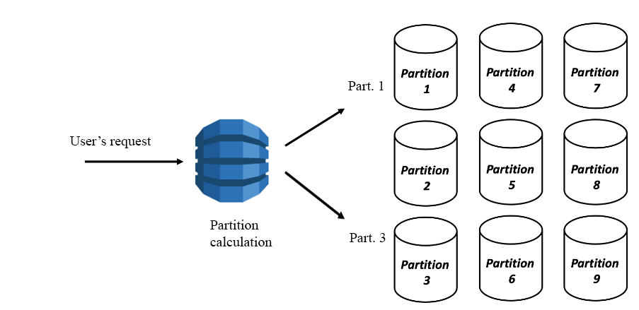

# AWS DynamoDB

## Theory

The Amazon DynamoDB is a fully managed *NoSQL* database service that provides fast and predictable performance with seamless scalability. 
DynamoDB lets you offload the administrative burdens of operating and scaling a distributed database so that you don't have to worry about hardware provisioning, setup and configuration, replication, software patching, or cluster scaling. DynamoDB also offers encryption at rest, which eliminates the operational burden and complexity involved in protecting sensitive data.
With DynamoDB, you can create database tables that can store and retrieve any amount of data and serve any level of request traffic. You can scale up or scale down your tables' throughput capacity without downtime or performance degradation. You can use the AWS Management Console to monitor resource utilization and performance metrics.
DynamoDB provides on-demand backup capability. It allows you to create full backups of your tables for long-term retention and archival for regulatory compliance needs. For more information, see Using On-Demand backup and restore for DynamoDB.
You can create on-demand backups and enable point-in-time recovery for your Amazon DynamoDB tables. Point-in-time recovery helps protect your tables from accidental write or delete operations. With point-in-time recovery, you can restore a table to any point in time during the last 35 days.
DynamoDB allows you to delete expired items from tables automatically to help you reduce storage usage and the cost of storing data that is no longer relevant. For more information, see Expiring items by using DynamoDB Time to Live (TTL).

In order to get familiar with the service some key concepts should be described
1. *Tables* – Similar to other database systems, DynamoDB stores data in tables. A table is a collection of data. 
2. *Items* – Each table contains zero or more items. An item is a group of attributes that is uniquely identifiable among all the other items. 
3. *Attributes* – Each item is composed of one or more attributes. An attribute is a fundamental data element, something that does not need to be broken down any further. 

[Here you can read more](https://docs.aws.amazon.com/amazondynamodb/latest/developerguide/WorkingWithTables.html)

When you create a table, in addition to the table name, you must specify the primary key of the table. The primary key uniquely identifies each item in the table, so that no two items can have the same key.

DynamoDB supports two different kinds of primary keys:
1. Partition key – A simple primary key, composed of one attribute known as the partition key. 
DynamoDB uses the partition key's value as input to an internal hash function. The output from the hash function determines the partition (physical storage internal to DynamoDB) in which the item will be stored. 
In a table that has only a partition key, no two items can have the same partition key value. 
The People table described in Tables, items, and attributes is an example of a table with a simple primary key (PersonID). You can access any item in the People table directly by providing the PersonId value for that item. 
2. Partition key and sort key – Referred to as a composite primary key, this type of key is composed of two attributes. The first attribute is the partition key, and the second attribute is the sort key. 
DynamoDB uses the partition key value as input to an internal hash function. The output from the hash function determines the partition (physical storage internal to DynamoDB) in which the item will be stored. All items with the same partition key value are stored together, in sorted order by sort key value. 
In a table that has a partition key and a sort key, it's possible for multiple items to have the same partition key value. However, those items must have different sort key values.  
A composite primary key gives you additional flexibility when querying data. 
*The partition key of an item is also known as its hash attribute. The term hash attribute derives from the use of an internal hash function in DynamoDB that evenly distributes data items across partitions, based on their partition key values.
The sort key of an item is also known as its range attribute. The term range attribute derives from the way DynamoDB stores items with the same partition key physically close together, in sorted order by the sort key value.*

Secondary indexes. 
You can create one or more secondary indexes on a table. A secondary index lets you query the data in the table using an alternate key, in addition to queries against the primary key. DynamoDB doesn't require that you use indexes, but they give your applications more flexibility when querying your data. After you create a secondary index on a table, you can read data from the index in much the same way as you do from the table.
 The service supports two kinds of indexes 
1. Global secondary index – An index with a partition key and sort key that can be different from those on the table.
2. Local secondary index – An index that has the same partition key as the table, but a different sort key. 

*You can think of these the following way: local secondary index defines distinctness within a single partition key whereas global one is about distinctness within a single pair of partition key and sort one*
Each table in DynamoDB has a quota of 20 global secondary indexes (default quota) and 5 local secondary indexes.

DynamoDB Streams is an optional feature that captures data modification events in DynamoDB tables. The data about these events appear in the stream in near-real time, and in the order that the events occurred. 
Each event is represented by a stream record. If you enable a stream on a table, DynamoDB Streams writes a stream record whenever one of the following events occurs:
A new item is added to the table: The stream captures an image of the entire item, including all of its attributes.
An item is updated: The stream captures the "before" and "after" image of any attributes that were modified in the item.
An item is deleted from the table: The stream captures an image of the entire item before it was deleted. 
Each stream record also contains the name of the table, the event timestamp, and other metadata. Stream records have a lifetime of 24 hours; after that, they are automatically removed from the stream. 
You can use DynamoDB Streams together with AWS Lambda to create a trigger—code that runs automatically whenever an event of interest appears in a stream. For example, consider a Customers table that contains customer information for a company. Suppose that you want to send a "welcome" email to each new customer. You could enable a stream on that table, and then associate the stream with a Lambda function. The Lambda function would run whenever a new stream record appears, but only process new items added to the Customers table. For any item that has an EmailAddress attribute, the Lambda function would invoke Amazon Simple Email Service (Amazon SES) to send an email to that address. 
[Read more](https://docs.aws.amazon.com/amazondynamodb/latest/developerguide/HowItWorks.CoreComponents.html#HowItWorks.CoreComponents.TablesItemsAttributes)

There are terms that are referred to as Read Capacity Unit (RCU) and Write Capacity Unit (WCU). These define throughput of a particular DynamoDB table and directly influence the cost 
Read capacity unit (RCU): Each API call to read data from your table is a read request. Read requests can be strongly consistent, eventually consistent, or transactional. For items up to 4 KB in size, one RCU can perform one strongly consistent read request per second. Items larger than 4 KB require additional RCUs. For items up to 4 KB in size, one RCU can perform two eventually consistent read requests per second. Transactional read requests require two RCUs to perform one read per second for items up to 4 KB. For example, a strongly consistent read of an 8 KB item would require two RCUs, an eventually consistent read of an 8 KB item would require one RCU, and a transactional read of an 8 KB item would require four RCUs 
Write capacity unit (WCU): Each API call to write data to your table is a write request. For items up to 1 KB in size, one WCU can perform one standard write request per second. Items larger than 1 KB require additional WCUs. Transactional write requests require two WCUs to perform one write per second for items up to 1 KB. For example, a standard write request of a 1 KB item would require one WCU, a standard write request of a 3 KB item would require three WCUs, and a transactional write request of a 3 KB item would require six WCUs.
[Read more](https://aws.amazon.com/dynamodb/pricing/provisioned/)

Pretty important to be aware of the most common way to reach a table programmatically via API. Scan and query operations are available for these purposes. 
In general, scan works with the whole item, considering all the attributes it has while query looks up a certain partition based on partition/hash key
[Ream more](https://dynobase.dev/dynamodb-scan-vs-query/#:~:text=Difference%20Between%20Query%20and%20Scan%20in%20DynamoDB&text=While%20Scan%20is%20%22scanning%22%20through,see%20the%20difference%20in%20speed.)

DynamoDB also provides with a service that cashes information and acts as an in-memory database. Amazon DynamoDB Accelerator (DAX) is a fully managed, highly available, in-memory cache for DynamoDB that delivers up to a 10x performance improvement.
[Read more](https://aws.amazon.com/dynamodb/dax/)

Below you can see the image that a bit visualise how DynamoDB works under the hood 

* DynamoDB operates partitions to evenly distribute data across storage
* It uses hash function to determine where to put data and where then find them

## General requirements
1. A mentee should be able to explain all general purpose of the service
2. A mentee should be able to answer all the questions during a demo session.

## Extra Materials

1. [AWS DynamoDB Official Documentation](https://docs.aws.amazon.com/dynamodb/)
2. [AWS DynamoDB Official FAQ](https://aws.amazon.com/dynamodb/faqs/)
3. [AWS Essentials](https://www.youtube.com/playlist?list=PLv2a_5pNAko0Mijc6mnv04xeOut443Wnk)
4. [AWS Concepts](https://www.youtube.com/playlist?list=PLv2a_5pNAko2Jl4Ks7V428ttvy-Fj4NKU)
5. [Cloud Computing Fundamentals](https://youtu.be/uroryFU78gM)
6. [AWS Tutorial for Begginers](https://youtu.be/IT1X42D1KeA)
7. [Getting started with Amazon DynamoDB](https://docs.aws.amazon.com/amazondynamodb/latest/developerguide/GettingStartedDynamoDB.html)
