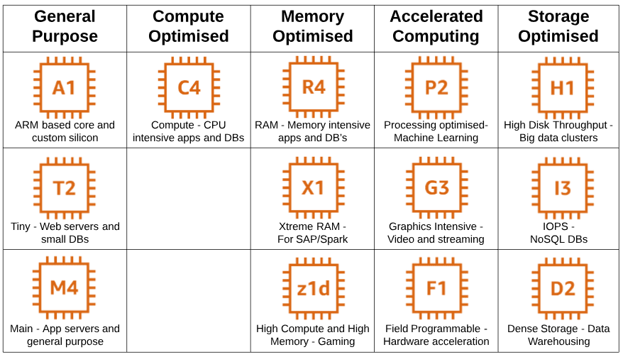

# Amazon EC2

## Theory

Amazon Elastic Compute Cloud (EC2) provides scalable computing capacity in the Amazon Web Services (AWS) Cloud. It means that you can launch as many(or as few) virtual servers as you need, configure security and networking, and manage storage. Amazon EC2 enables you to scale up or down(increase or decrease the number of running virtual servers) to handle changes in requirements or spikes in popularity, reducing your need to forecast traffic.

### Key concepts

In order to get familiar with the service some key concepts should be described:
1. *Instance* - a virtual server.
2. *Volume* - a virtual server's storage device, i.e. the device that is used for storing the virtual server's data.
3. *AMI*(Amazon Machine Image) - an image of the instance itself, a copy of its configurations. It also includes snapshots of all EBS volumes of the instance. It it used to launch new instances.
4. *Snapshot* - a point-in-time copy of the instance's volume.
5. *Security Group* - a virtual firewall that controlls the instance's incoming and outgoing traffic.

### EC2 instance types

There are several types of EC2 instances:
1. General purpose(T, M) - standard instances with the balance of CPU, RAM and storage
2. Compute optimized(C) - more powerful CPUs
3. Memory optimized(X, R) - more RAM
4. Storage optimized(D, I) - more disk storage
5. Accelerated computing(G, P) - more powerful GPUs

[Read more](https://aws.amazon.com/ec2/instance-types/)

### EC2 IP addresses

Amazon EC2 supports both IPv4 and IPv6 addressing. By default, the IPv4 addressing protocol is used. You can optionally turn on the IPv6 addressing.

When you create an EC2 instance, it can have the following IP addresses:
1. Private IPv4 address - not reachable over the Internet
2. Public IPv4 address - used to connect to your instance over the Internet
3. IPv6 address - can be configured to remain private or be reachable over the Internet

[Read more](https://docs.aws.amazon.com/AWSEC2/latest/UserGuide/using-instance-addressing.html)

There is a special kind of IP address than you can assign to your EC2 instance - an Elastic IP address.
• Elastic IP address - public static IPv4 address that you can allocate to your account manually. 

You can associate an elastic IP address to and disassociate it from your instances as you require. After allocating, it remains in your account until you choose to release it.

[Read more](https://docs.aws.amazon.com/AWSEC2/latest/UserGuide/elastic-ip-addresses-eip.html)

### Elastic Block Store (EBS)

Elastic Block Store (EBS) is an easy to use, high-performance, block-storage service designed for use with Amazon Elastic Compute Cloud.

Amazon EBS provides multiple volume types that allow you to optimize storage performance and cost for a broad range of applications. These volume types are divided into two major categories: SSD-backed storage for transactional workloads, such as databases, virtual desktops and boot volumes, and HDD-backed storage for throughput intensive workloads, such as MapReduce and log processing.

SSD-based volumes:
1. General Purpose Volumes - gp2, gp3
2. Provisioned IOPS Volume - io1, io2, io2 Block Express

HDD-based volumes:
1. Throughput Optimized HDD volumes st1
2. Cold HDD Volumes sc1

A very important thing to keep in mind has to do with EBS Migration between multiple AZs or Regions. EBS Volumes are only locked to specific AZ.

To migrate it to a different AZ (or Region):
1. Snapshot the volume
2. (optional) Copy the volume to a different region
3. Create a volume from the snapshot in the AZ of your choice

[Read more](https://docs.aws.amazon.com/AWSEC2/latest/UserGuide/AmazonEBS.html)

### EC2 Auto Scaling

EC2 Auto Scaling is used as a tool for automatic horizontal scaling of your EC2 instances.

It helps you ensure that you have the correct number of Amazon EC2 instances available to handle the load for your application by doing the following:  
• You create collections of EC2 instances, called Auto Scaling groups.  
• You can specify the minimum number of instances in each Auto Scaling group, and Amazon EC2 Auto Scaling ensures that your group never goes below this size.  
• You can specify the maximum number of instances in each Auto Scaling group, and Amazon EC2 Auto Scaling ensures that your group never goes above this size.  

If you specify the desired capacity, either when you create the group or at any time thereafter, Amazon EC2 Auto Scaling ensures that your group has this many instances.  
If you specify scaling policies, then Amazon EC2 Auto Scaling can launch or terminate instances as demand on your application increases or decreases.

[Read more](https://docs.aws.amazon.com/autoscaling/ec2/userguide/what-is-amazon-ec2-auto-scaling.html)

## Pricing considerations

There are multiple ways to pay for EC2 instances:
1. On-demand - pay-per-hour, no upfront costs, no long time commitments
2. Spot Instances - pay-per-hour, no upfront costs, lower price than on-demand due to using the spare computing capacity
3. Reserved Instances - reservation of a particular instance for long periods of time(>1 year), full upfront/partial upfront/no upfront costs, no ability to cancel your purchase
4. Savings Plan - a pricing model with a long-time commitment(1-year or 3-year term) which has 2 types of plans - more flexible, more expensive(Compute Savings Plan) and less flexible, less expensive(Instance Savings Plan)
5. Dedicated Host - renting the entire physical server solely for your use

[Read more](https://aws.amazon.com/ec2/pricing/)

When using EC2 with EBS volumes, you also have to pay for the volume depending on its size.

[Read more](https://aws.amazon.com/ebs/pricing/)

## Quiz

1. Which of the following is the AWS service that is used for providing scalable virtual servers(computing capacity)?
- a) Elastic Cloud Computing
- b) Elastic Computer Cloud
- c) Elastic Compute Cloud
- d) Elastic Calculator Cloud
2. Can you detach an EBS volume that isn't used as the root device from a running EC2 instance without stopping it?
- a) No
- b) Yes
3. Can you delete a snapshot of an EBS volume that is used as the root device of a registered AMI?
- a) No
- b) Yes
4. Can you restart an instance after its termination?
- a) No
- b) Yes
5. Which EBS volume types DO exist?
- a) ssd, gp2, io1, Throughtput Optimized HDD
- b) gp2, gp3, io1, Cold HDD
- c) gp2, gp3, sata1, magnetic storage
- d) ssd, hdd, magnetic storage
6. Which IP addresses can you use to connect to the EC2 instance from the Internet?
- a) Public IPv4 address
- b) Private IPv4 address
- c) IPv6 address
- d) Elastic IP address
7. When you REBOOT an instance, which of the following instance attributes DO NOT change?
- a) Public IPv4 address
- b) Private IPv4 address
- c) IPv6 address
- d) Elastic IP address
8. When you STOP and START an instance, which of the following instance attributes DO NOT change?
- a) Public IPv4 address
- b) Private IPv4 address
- c) IPv6 address
- d) Elastic IP address
9. If you need to attach an EBS volume to an EC2 instance, which statement is correct?
- a) EC2 should be in the same Availability Zone as the volume
- b) EC2 should be in the same Region as the volume
- c) EC2 should be in the same Datacenter as the volume
- d) EC2 and EBS volume could be in any Region or Availability Zone
10. Which of the following are instance purchasing options?
- a) On-demand
- b) Reserved Instances
- c) Dedicated Hosts
- d) Spot Instances

## General requirements
1. A mentee should be able to explain the general purpose of the service
2. A mentee should be able to answer all the questions during a demo session.

## Keys

1. c
2. b
3. a
4. a
5. b
6. a, c, d
7. a, b, c, d
8. b, c, d
9. a
10. a, b, c, d

## Extra Materials

1. [Amazon EC2 Official Documentation](https://docs.aws.amazon.com/AWSEC2/latest/UserGuide/)
2. [Amazon EC2 Official FAQ](https://aws.amazon.com/ec2/faqs/)
3. [Introduction to Amazon EC2 (video)](https://www.youtube.com/watch?v=KpVNEzpvaY0)
4. [How to setup EC2 Auto Scaling (video)](https://www.youtube.com/watch?v=aVE0w40obKM)
