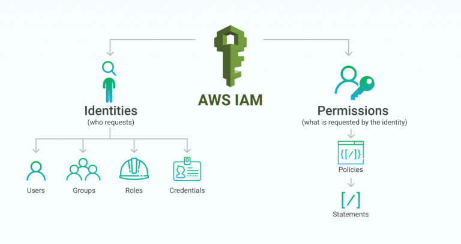

# AWS IAM

## Theory

AWS Identity and Access Management (IAM) is an AWS service that helps you securely control access to your account and your AWS resources. You use IAM to control who is authenticated (signed in) and authorized (has permissions) to use resources.

With IAM, you can create multiple IAM users under the umbrella of your AWS account or enable temporary access through identity federation with your corporate directory. In some cases, you can also enable access to resources across AWS accounts.
Without IAM, however, you must either create multiple AWS accounts — each with its own billing and subscriptions to AWS products — or your employees must share the security credentials of a single AWS account. In addition, without IAM, you cannot control the tasks a particular user or system can do and what AWS resources they might use.
[Read more](https://aws.amazon.com/dynamodb/pricing/provisioned/)

### AWS account root user

When you first create an Amazon Web Services (AWS) account, you begin with one identity that has complete access to all AWS services and resources in the account. This identity is called the AWS account root user. You can sign in as the root user using the email address and password that you used to create the account.

We strongly recommend that you do not use the root user for your everyday tasks, even the administrative ones. What you should create and use instead is an IAM User.

Anyone who has root user credentials for your AWS account has unrestricted access to all the resources in your account, including billing information. Plus, the root user can delete the entire AWS account, so you should only use it in rare circumstances when you cannot use your IAM User!
[Read more](https://docs.aws.amazon.com/IAM/latest/UserGuide/id_root-user.html)

### Key concepts

In order to get familiar with the service some key concepts should be described:
1. *IAM User*(different from root users!) - an entity that you can create in AWS. The IAM user represents the person or service who uses this entity to interact with AWS. A primary use for IAM users is to give people the ability to sign in to the AWS Management Console for interactive tasks and to make programmatic requests to AWS services using the API or CLI.
2. *IAM User group* - an entity that represents a collection of IAM users. A user group is a way to attach permissions to multiple users at one time. For example, you could have a user group called Admins and give that user group the types of permissions that administrators typically need. Any user that will be assigned to this user group automatically gets all the permissions that the users in this group are given.
3. *IAM Role* - an identity with permissions that determine what the identity can and cannot do in AWS. It is very similar to an IAM User. However, a role does not have any credentials (password or access keys) associated with it. Instead of being uniquely associated with one person, a role is intended to be assumable by anyone who needs it. For example, any IAM User(or even multiple IAM Users at the same time) can assume a role to temporarily take on different permissions for a specific task.
4. *IAM Policy* - an entity that defines permissions to perform tasks in AWS services. It can be assigned to an IAM User, IAM User group, IAM Role. IAM Policies can be divided into 2 groups - identity-based policies and resource-based policies. Identity-based policies are assigned to an identity and specify what they can and cannot do. Resource-based policies are assigned to a resource and specify WHO can work with this resource and what actions they can do. AWS evaluates these policies when a principal, such as a user, makes a request to AWS. [Read more](https://docs.aws.amazon.com/IAM/latest/UserGuide/access_policies.html)

The first three items in the list above are generally referred to as *IAM identities*.
[Read more](https://docs.aws.amazon.com/IAM/latest/UserGuide/id.html)

## Pricing considerations

There is no charge for IAM usage, it's free.

## General requirements
1. A mentee should be able to explain the general purpose of the service
2. A mentee should be able to answer all the questions during a demo session.

## Extra Materials

1. [AWS IAM Official Documentation](https://docs.aws.amazon.com/IAM/latest/UserGuide/)
2. [AWS IAM Official FAQ](https://aws.amazon.com/iam/faqs/)
3. [IAM Ninja (video)](https://www.youtube.com/watch?v=aISWoPf_XNE)
4. [Become an IAM Policy master in 60 minutes or less (video)](https://youtu.be/YQsK4MtsELU)
5. [IAM Policy evaluation logic](https://docs.aws.amazon.com/IAM/latest/UserGuide/reference_policies_evaluation-logic.html)