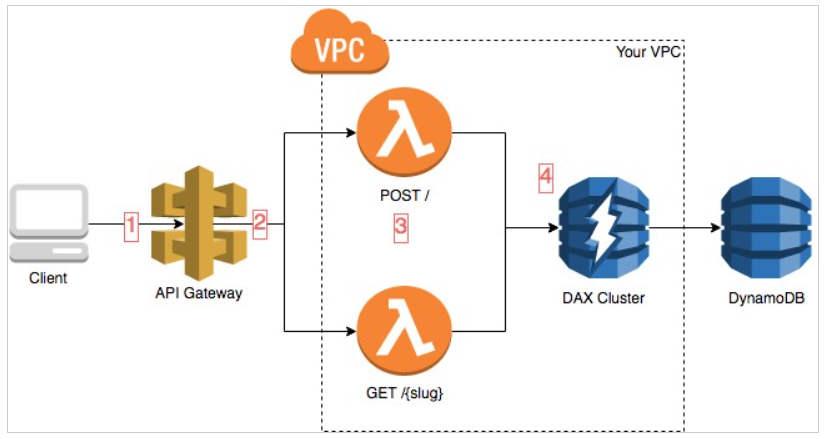

# AWS Lambda

## Theory

The AWS Lambda service is the most remarkable representative of the serverless technologies on AWS. In this context, the term 'serverless'
means not the complete absence of any servers but the fact that the ones are fully managed by AWS. In order to get in clearly the following 
definition would be the most appropriate\
*Lambda is a service that lets you run code as functions without provisioning or managing servers*

In order to get familiar with the service some key concepts should be described
1. A *function* is a resource that you can invoke to run your code in Lambda. A function has code to process the events that you pass into the function or that other AWS services send to the function.
2. A *trigger* is a resource or configuration that invokes a Lambda function. Triggers include AWS services that you can configure to invoke a function and event source mappings. An event source mapping is a resource in Lambda that reads items from a stream or queue and invokes a function.
3. An *event* is a JSON-formatted document that contains data for a Lambda function to process. The runtime converts the event to an object and passes it to your function code. When you invoke a function, you determine the structure and contents of the event.
4. An *execution environment* provides a secure and isolated runtime environment for your Lambda function. An execution environment manages the processes and resources that are required to run the function. The execution environment provides lifecycle support for the function and for any extensions associated with your function.
5. The *instruction set* architecture determines the type of computer processor that Lambda uses to run the function.
6. You deploy your Lambda function code using a *deployment package*. Lambda supports two types of deployment packages: .zip files and containers.
7. The *runtime* provides a language-specific environment that runs in an execution environment.
8. A *Lambda layer* is a .zip file archive that can contain additional code or other content. A layer can contain libraries, a custom runtime, data, or configuration files.
9. Lambda *extensions* enable you to augment your functions. For example, you can use extensions to integrate your functions with your preferred monitoring, observability, security, and governance tools.
10. *Concurrency* is the number of requests that your function is serving at any given time.
11. When you invoke or view a function, you can include a *qualifier* to specify a version or alias.  version is an immutable snapshot of a function's code and configuration that has a numerical qualifier.An alias is a pointer to a version that you can update to map to a different version, or split traffic between two versions.
12. A *destination* is an AWS resource where Lambda can send events from an asynchronous invocation. You can configure a destination for events that fail processing.  
[Here you can read more about all the concepts](https://docs.aws.amazon.com/lambda/latest/dg/gettingstarted-concepts.html)

Keeping in mind that definition, note there are some features within the service which we'll briefly cover below

- AWS Lambda natively supports Java, Go, PowerShell, Node.js, C#, Python, and Ruby code and *provides a Runtime API which allows you to use any additional programming languages to author your functions*   [read more](https://docs.aws.amazon.com/lambda/latest/dg/lambda-runtimes.html)
- In order to configure your function in Lambda all you need to specify is the amount of memory allocated to your Lambda function. AWS Lambda allocates CPU power proportional to the memory you specify using the same ratio as a general purpose EC2 instance type.    [read more](https://docs.aws.amazon.com/lambda/latest/dg/lambda-functions.html)
- Functions can access AWS services or non-AWS services, AWS services running in VPCs and Non-AWS services running on EC2 instances in an AWS VPC     [read more](https://docs.aws.amazon.com/lambda/latest/dg/lambda-functions.html)
- You can request additional memory in 1 MB increments from 128 MB to 10240 MB  [read more](https://docs.aws.amazon.com/lambda/latest/dg/configuration-function-common.html)
- There is a maximum execution time set - 900 seconds (15 minutes). The default value is 3 seconds  [read more](https://aws.amazon.com/about-aws/whats-new/2018/10/aws-lambda-supports-functions-that-can-run-up-to-15-minutes/)
- AWS Lambda stores code in Amazon S3 and encrypts it at rest.
- There are two types of invocation in Lambda: synchronous and asynchronous ones. The key difference between them is that the first one considers obtaining response from the invoked function. The second approach continue processing inbound events without waiting response   [read more](https://docs.aws.amazon.com/lambda/latest/dg/lambda-invocation.html)
- Lambda is an *event-driven* compute service where AWS Lambda runs code in response to events such as changes to data in an S3 bucket or a DynamoDB table. So, it enables a way not to call a function directly but triggering it with an event (adding an object to SNS for instance)   [read more](https://docs.aws.amazon.com/lambda/latest/dg/invocation-eventsourcemapping.html)
- There are execution role assigned to a lambda function and resource policy. In order not to get messed within them just remember that execution role is what a function is able to perform while running and resource policy is what service is able to call a function specified   [read more](https://docs.aws.amazon.com/lambda/latest/dg/lambda-intro-execution-role.html)
- Lambda is able to scale in and scale out automatically in order to handle bursts. Safe limits are 1000 concurrency per region. Maximum up to 3000 depending on a region. It's able to scale by 500 function per minute until the limit is reached or burst is served.   [read more](https://docs.aws.amazon.com/lambda/latest/dg/configuration-concurrency.html)
- You should differ provisioned and reserved concurrency. The first one guarantees that specified concurrency is served immediately without scaling by 500 functions (mentioned above). The second one is about having a certain number of concurrency prevented from using by another functions within an account   [read more](https://docs.aws.amazon.com/lambda/latest/dg/configuration-concurrency.html)
- A Lambda function has layers.  [read more](https://docs.aws.amazon.com/lambda/latest/dg/configuration-layers.html) 
- Payload invocation limits are 6 MB for a synchronous way and 256 KB for asynchronous one.

Below you can see a typical example of usage of Lambda service 

* Normally there is a trigger to invoke a Lambda function - here it an HTTP request obtained from API Gateway
* API Gateway forwards a request to the appropriate function based on passed data
* The Lambda functions are run inside a VPC, which allows them to access VPC resources such as your DAX cluster
* The DAX cluster is also inside the VPC, which means it can be reached by the Lambda functions.
* DynamoDB is used as a storage for data

## General requirements
1. A mentee should be able to explain general purpose of the service
2. A mentee should be able to answer all the questions during a demo session.

## Extra Materials

1. [AWS Lambda Official Documentation](https://aws.amazon.com/lambda/)
2. [AWS Lambda Official FAQ](https://aws.amazon.com/lambda/faqs/)
3. [AWS Essentials](https://www.youtube.com/playlist?list=PLv2a_5pNAko0Mijc6mnv04xeOut443Wnk)
4. [AWS Concepts](https://www.youtube.com/playlist?list=PLv2a_5pNAko2Jl4Ks7V428ttvy-Fj4NKU)
5. [Amazon S3](https://aws.amazon.com/s3/)
6. [Cloud Computing Fundamentals](https://youtu.be/uroryFU78gM)
7. [AWS Tutorial for Begginers](https://youtu.be/IT1X42D1KeA)
8. [Getting started with S3](https://docs.aws.amazon.com/AmazonS3/latest/gsg/GetStartedWithS3.html)
9. [Getting started with Amazon VPC](https://docs.aws.amazon.com/vpc/latest/userguide/vpc-getting-started.html)

