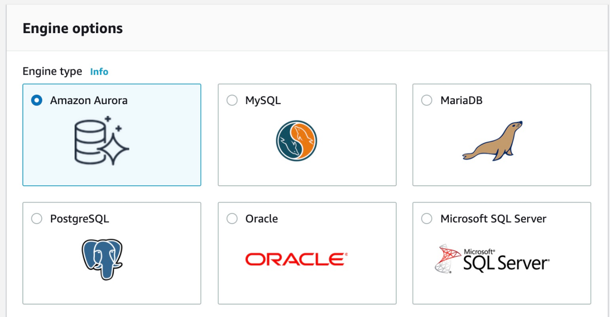
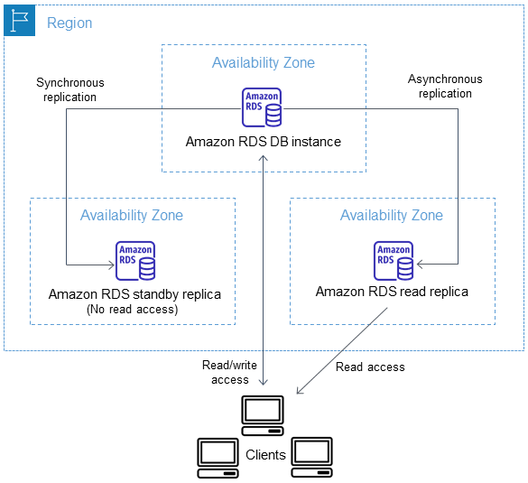

# Amazon RDS

## Theory

Amazon Relational Database Service (RDS) is a fully managed service that provides the ability to create, configure and operate different relational databases. In this definition fully managed means that you don't have to think about the server management tasks(i.e., OS configuration and patching, software patching, backup creation). Instead, Amazon RDS takes care of these tasks allowing you to focus on using the database itself.

Apart from that, there are lots of other features that come out-of-the-box when you start using RDS. Here are some of those features:  
• Amazon RDS allows you to choose how much memory, storage, IOPS and CPU resources your RDS instance will have with the ability to scale each of those independently.  
• To deliver a managed service experience, Amazon RDS doesn't provide shell access to DB instances. It also restricts access to certain system procedures and tables that require advanced privileges.  
• You can have automated backups performed on a particular schedule(which are turned on by default), or manually create your own backup snapshot.  
• You can control who can access your RDS databases by using AWS Identity and Access Management (IAM) to define users and permissions.  

As with EC2 instances, RDS instances are created inside a VPC, they can have a VPC security group and a public IP address assigned to them. Although there is a slight difference between EC2 and RDS instances - the latter are created inside *DB subnet groups* instead of ordinary VPC subnets.

### Key concepts

In order to get familiar with the service some key concepts should be described:
1. *Instance* - an isolated database environment running in the cloud. Think of it as a virtual server with a database installed on it.
2. *Engine* - a specific database software that runs on your DB instance(e.g., MySQL, PostgreSQL, Oracle, etc.).
3. *DB subnet group* - a collection of subnets (typically private) that you create in a VPC and that you then designate for your DB instances. Each DB subnet group should have subnets in at least two Availability Zones in a given AWS Region. When creating a DB instance in a VPC, you choose a DB subnet group for it.

### RDS authentication options

Amazon RDS supports several ways to authenticate database users:
1. Password authentication - based on the database itself(by way of creating internal database users and specifying passwords for them).
2. IAM authentication - based on IAM capabilities and resources(users).
3. Kerberos authentication - external type of authentication which uses Kerberos protocol and Microsoft Active Directory.

[Read more](https://docs.aws.amazon.com/AmazonRDS/latest/UserGuide/database-authentication.html)

### RDS replication options

Amazon RDS replication is the option which allows you to have replicas(copies) of your DB instance. You can create 2 kinds of these replicas:
1. Standby replica - data is synchronously replicated between it and the original DB instance, cannot accept connections for reading data.
2. Read replica - data is asynchronously replicated between it and the original DB instance, can accept connections for reading data(thus decreasing the workload on your original DB instance).

[Read more about read replicas](https://docs.aws.amazon.com/AmazonRDS/latest/UserGuide/USER_ReadRepl.html#USER_ReadRepl.Overview)

[Read more about standby replicas](https://docs.aws.amazon.com/AmazonRDS/latest/UserGuide/Concepts.MultiAZ.html)

### RDS backup options

Amazon RDS creates and saves automated backups of your DB instance during the backup window of your DB instance. Here's it works:  
• If a DB instance is available and a DB snapshot copy isn't being created for this DB instance, then DB instance can be backed up.  
• RDS creates a storage volume snapshot of your DB instance(backing up the entire DB instance, not just individual databases).  
• RDS saves the automated backups of your DB instance according to the backup retention period that you specify.  

If you need to, you can also create your backups manually.

[Read more](https://docs.aws.amazon.com/AmazonRDS/latest/UserGuide/USER_WorkingWithAutomatedBackups.html)

## Pricing considerations

Amazon RDS pricing depends on a number of factors, such as RDS instance type, the database engine that is used(MySQL, PostgreSQL, etc.) and also the size of the storage for your data(in GBs).

Apart from that, similar to EC2, Amazon RDS offers 2 types of pricing: 
1. On-demand - pay-per-hour, no upfront costs, no long time commitments
2. Reserved Instances - reservation of a particular instance for long periods of time(1 year or 3 years), full upfront/partial upfront/no upfront costs, no ability to cancel your purchase

[Read more](https://aws.amazon.com/rds/pricing/)

## General requirements
1. A mentee should be able to explain the general purpose of the service
2. A mentee should be able to answer all the questions during a demo session.

## Extra Materials

1. [Amazon RDS Official Documentation](https://docs.aws.amazon.com/AmazonRDS/latest/UserGuide/)
2. [Amazon RDS Official FAQ](https://aws.amazon.com/rds/faqs/)
3. [Amazon RDS Tutorial (video)](https://www.youtube.com/watch?v=KpVNEzpvaY0)