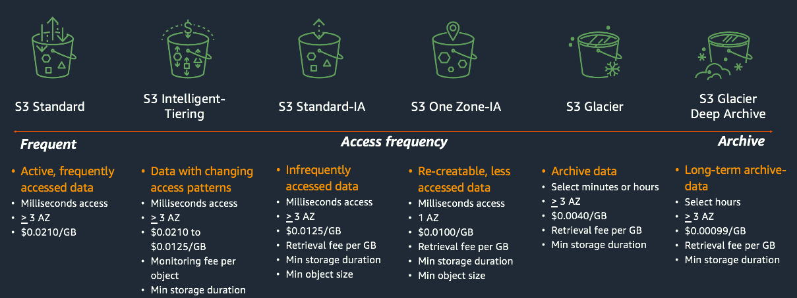

# Amazon S3

## Theory

AWS Simple Storage Service (S3) is a highly scalable, fast, and durable solution for data storage of any data type. Unlike the operating systems we are all used to, Amazon S3 does not store files in a file system. Instead it stores files as objects. The way you use Amazon S3 is similar to other popular cloud storage products like Dropbox and Google Drive - you can upload files, videos, and documents. This makes Amazon S3 very flexible and platform agnostic.

### How Amazon S3 works

Amazon S3 works as an object storage service. When a user uploads data to S3, that file is stored as an object with metadata and the object as a whole is given an ID.
There are two different kinds of metadata - *system-defined* and *user-defined* metadata. 

System metadata is used for S3 to maintain important object information such as creation date, size, and last modified.
Objects also take in user-defined metadata. User-defined metadata allows users to assign key-value pairs to the data they upload. These key-value pairs help users identify, organize and assign objects to specific resources, or allow for easy retrieval.

Some major advantages of using Amazon S3 include durability, security, and reliability. Per Amazon’s documentation, Amazon S3 provides customers with a 99.999999999%(11 nines) rate of durability.

### Common use-cases

The following are some of the most common use-cases for Amazon S3:
1. Data storage 
2. Data backup & recovery
3. Data sharing (e.g., with other people)
4. Static website hosting

### Key concepts

In order to get familiar with the service some key concepts should be described:
1. *S3 Bucket* - a container for objects stored in S3. Buckets are defined at the region level(created in a particular region). But at the same time they must have globally unique names(across all standard regions)
2. *S3 Object* - a file that combines data and metadata. An object is uniquely identified in a bucket by a key (name) and a version ID.
3. *Region* - a geographical grouping of several Availability Zones.
4. *Availability Zone* - an abstraction that represents one or more datacenters in a particular Region.

### Amazon S3 features

1. Storage Classes

Amazon S3 offers a range of storage classes that you can choose from based on the data access, resiliency, and cost requirements of your workloads. S3 storage classes are purpose-built to provide the lowest cost storage for different access patterns.

The list of storage classes available at the moment:  
• S3 Standard - object storage for frequently accessed data. Used for a wide variety of general use cases.  
• S3 Standard-IA(Infrequent Access) - object storage for data that is accessed less frequently. Used for long-term storage, backups, and as a data store for disaster recovery files.  
• S3 One Zone-IA(Infrequent Access) - object storage for data that is accessed less frequently. Unlike other S3 Storage Classes which store data in a minimum of three Availability Zones (AZs), S3 One Zone-IA stores data in a single AZ and costs 20% less than S3 Standard-IA. Used as a lower-cost option.  
• S3 Intelligent-Tiering - object storage with the ability to reduce your storage costs by automatically moving data(objects) to the most cost-effective access tier based on access frequency.  
• S3 Glacier Instant Retrieval - an archive storage class that delivers the lowest-cost storage for long-lived data that is rarely accessed and requires retrieval in milliseconds. With S3 Glacier Instant Retrieval, you can save up to 68% on storage costs compared to using the S3 Standard-Infrequent Access (S3 Standard-IA) storage class, when your data is accessed once per quarter.  
• S3 Glacier Flexible Retrieval - an archive storage(that is up to 10% lower cost than S3 Glacier Instant Retrieval), for data that is accessed 1—2 times per year and is retrieved asynchronously(i.e. does not require immediate access).  
• S3 Glacier Deep Archive - the lowest-cost storage class that supports long-term retention and digital preservation for data that may be accessed once or twice in a year.

2. Bucket versioning

Versioning in Amazon S3 is a means of keeping multiple variants of an object in the same bucket. You can use the S3 Versioning feature to preserve, retrieve, and restore every version of every object stored in your buckets.

After versioning is enabled for a bucket, if Amazon S3 receives multiple write requests for the same object simultaneously, it stores all of those objects.

Versioning-enabled buckets can help you recover objects from accidental deletion or overwrite. For example, if you delete an object, Amazon S3 inserts a delete marker instead of removing the object permanently. The delete marker becomes the current object version. If you overwrite an object, it results in a new object version in the bucket. You can always restore the previous version.

By default, S3 Versioning is disabled on buckets, and you must explicitly enable it. Once you enable versioning on a bucket, you cannot disable it. You can only *suspend* versioning on that bucket.

3. Static website hosting

You can use Amazon S3 to host a static website. On a static website, individual webpages include static content. They might also contain client-side scripts.

4. Replication

Replication enables automatic, asynchronous copying of objects across Amazon S3 buckets. 

Buckets that are configured for object replication can be owned by the same AWS account or by different accounts. You can replicate objects to a single destination bucket or to multiple destination buckets. The destination buckets can be in different AWS Regions or within the same Region as the source bucket.

### Amazon S3 security

Security in Amazon S3 is provided at different levels. S3 Bucket security can be:
1. User policies - creating IAM Policies that control which identities can make API calls to S3

2. Resource policies -  
2.1. Bucket Policies is bucket-wide rules from the S3 console (it also allows cross account access)  
2.2. Access Points can help control access to S3 of many different applications on a per application basis. Each Access Point has its own permissions to S3, thus allowing different applications have their own permissions to S3.  
2.2. Object Access Control List (ACL) provides finer grain control.  
2.3. Bucket ACL – less commonly used.  
[Read more](https://docs.aws.amazon.com/AmazonS3/latest/userguide/s3-access-control.html)

## Pricing considerations

There are 2 main cost components to consider when storing data in Amazon S3:
1. Storage - for storing objects in S3 buckets. S3 storage costs depend on your objects' size, how long you stored the objects during the month, and the storage class(for example, S3 Standard - first 50 TB / month - $0.023 per GB).
2. Requests & data retrievals - for requests made against S3 buckets and objects. S3 request costs are based on the request type(GET, PUT), and are charged on the quantity of requests(for example, S3 Standard - 1000 GET requests - $0.0004).

Additionally, Amazon S3 can charge you for various bucket management activities(analytics, replication, etc.).
[Read more](https://aws.amazon.com/s3/pricing/?nc=sn&loc=4)

## General requirements
1. A mentee should be able to explain the general purpose of the service
2. A mentee should be able to answer all the questions during a demo session.

## Extra Materials

1. [Amazon S3 Official Documentation](https://docs.aws.amazon.com/AmazonS3/latest/userguide/)
2. [Amazon S3 Official FAQ](https://aws.amazon.com/s3/faqs/)
3. [Amazon S3 Tutorial for Beginners (video)](https://www.youtube.com/watch?v=XGcoeEyt2UM)
4. [Amazon S3 Storage Classes](https://aws.amazon.com/s3/storage-classes/)
5. [Amazon S3 Object lifecycle management](https://docs.aws.amazon.com/AmazonS3/latest/userguide/object-lifecycle-mgmt.html)