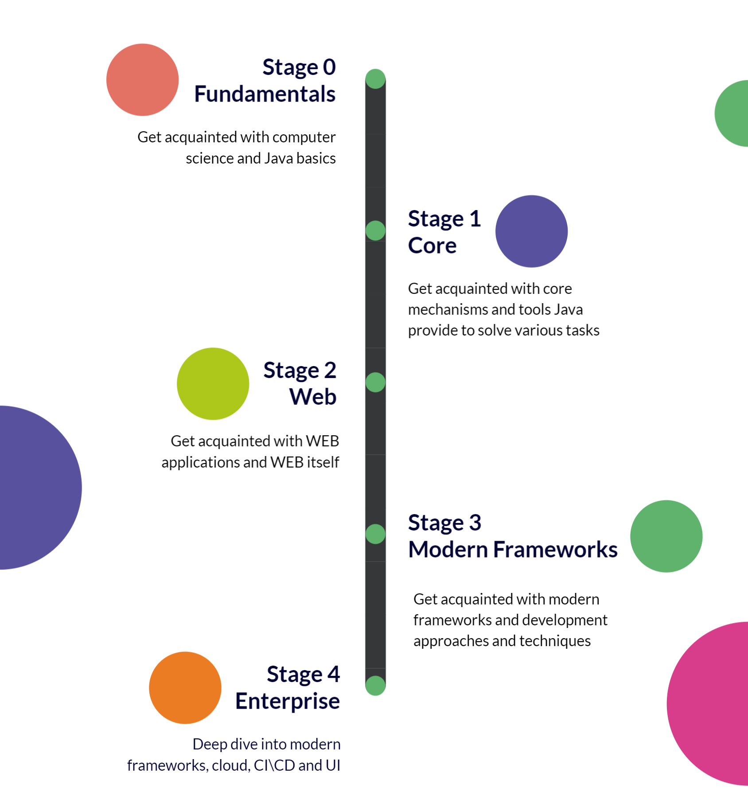

# Syllabus

## What is Syllabus?
As a student, you may have heard the word “syllabus” and wondered what that is, or the term “syllabus” might be a brand-new word for you. A syllabus is a document that outlines all the essential information about a college course. It lists the topics you will study, as well as the due dates of any coursework including tests, quizzes, or exams. 

Since our school is continous process, we alter syllabus definition to exclude due dates and some other parts like quizes.

## Content
MJC School syllabus consists of 5 stages with a various levels of community support, toolset and formats. In general, you may observe the process on the picture below:

### Stage 0. Fundamentals
Basic stage to get acquainted with computer science and Java basics.

**Format**: Self-paced, Autoverification

**Community support**: Community Chat, Community Events

**Toolset**: Autocode, Github, Gitlab

Following topics are covered: 
* Computer science course 
* Infrastructure (environment) 
* JDK, JRE, Git Basics, IDE, Junit concepts 
* Java Lang syntax 
* Java Fundamentals 
* Algorithms and Data Structures 
* OOP/OOD Fundamentals 

### Stage 1. Core
A stage to get acquainted with core mechanisms and tools Java provide to solve various tasks.

**Format**: Self-paced, Autoverification

**Community support**: Community Chat, Community Events

**Toolset**: Autocode, Github, Gitlab

Following topics are covered: 
* Exceptions 
* Strings 
* Generics 
* Collections
* Stream API - lambdas, streams, func. Interfaces 
* Java. I/O, NIO 
* Data Formats (JSON, XML, YML) 
* Concurrency 

### Stage 2. WEB
A stage to get acquainted with WEB applications and WEB itself.

**Format**: Self-paced, Autoverification

**Community support**: Community Chat, Community Events

**Toolset**: Autocode, Github, Gitlab

Following topics are covered: 
* Git & Build Tools 
* Web, HTTP(s) methods, Java EE Servlets. 
* SQL 
* Architecture basics (Design patterns, DAO/repository, JDBC). Architectural patterns. Engineering Best-practices 

### Stage 3. Modern Frameworks
A stage to get acquainted with modern frameworks and development approaches and techniques.

**Format**: Self-paced, Autoverification, Interview

**Community support**: Community Chat, Community Events, Consultants, Roast Battle

**Toolset**: Autocode, Github, Gitlab

Following topics are covered: 
* Architecture Advanced
* ORM
* Spring Core 
* REST Basics
* Swagger 

### Stage 4. Enterprise
A stage to dive into frameworks and modern engineering practices.

**Format**: Personal/group mentoring, Interview

**Community support**: Community Chat, Community Events, Roast Battle, Mentoring

**Toolset**: Github

Following topics are covered: 
* CI\CD 
* REST Advanced
* Authentication & Authorization, Spring Security 
* Modern UI 
* AWS 
* Spring Data 

## Syllabus Readiness

| Module | Theory Readiness | Practice Readiness | Group Exists |
|--------|:----------------:|:------------------:|:------------:|
| **Stage 0. Fundamentals** ||||
| Computer Science |       100%       |        100%        | Yes |
| Infrastructure (environment) |       100%       |        100%        | Yes |
| JDK, JRE, Git Basics, IDE, Junit concepts |       100%       |        100%        | Yes |
| Java Lang syntax |       100%       |        100%        | Yes |
| Java Fundamentals |       100%       |        100%        | Yes |
| Algorithms and Data Structures |       100%       |        100%        | Yes |
| OOP/OOD Fundamentals |       100%       |        100%        | Yes |
| **Stage 1. Core** ||||
| Exceptions |       100%       |        100%        | No |
| Strings |       100%       |         0%         | Yes |
| Generics |        0%        |         0%         | No |
| Collections (+collection internals) |       100%       |        100%        | No |
| Stream API - lambdas, streams, func. Interfaces |        0%        |         0%         | No |
| Java. I/O, NIO |        0%        |         0%         | No |
| Data Formats (JSON, XML, YML) |        0%        |         0%         | No |
| Concurrency |        0%        |         0%         | No |
| **Stage 2. Web** ||||
| Git & Build Tools |       100%       |        100%        | No |
| Web, HTTP(s) methods, Java EE Servlets |       100%       |        100%        | No |
| SQL |       100%       |        100%        | No |
| Architecture basics. Architectural patterns. Engineering Best-practices |        0%        |         0%         | No |
| **Stage 3. Modern Frameworks** ||||
| Architecture Advanced |      100 %       |       100 %        | Yes |
| ORM |       100%       |         0%         | Yes |
| Spring Core |       100%       |         0%         | Yes |
| REST Basics |       100%       |         0%         | Yes |
| Swagger |        0%        |         0%         | Yes |
| **Stage 4. Enterprise** ||||
| CI\CD |       100%       |        100%        | No |
| REST Advanced |       100%       |        100%        | No |
| Authentication & Authorization, Spring Security |       100%       |        100%        | No |
| Modern UI |       100%       |        100%        | No |
| AWS |       100%       |        100%        | No |
| Spring Data |       100%       |        100%        | No |